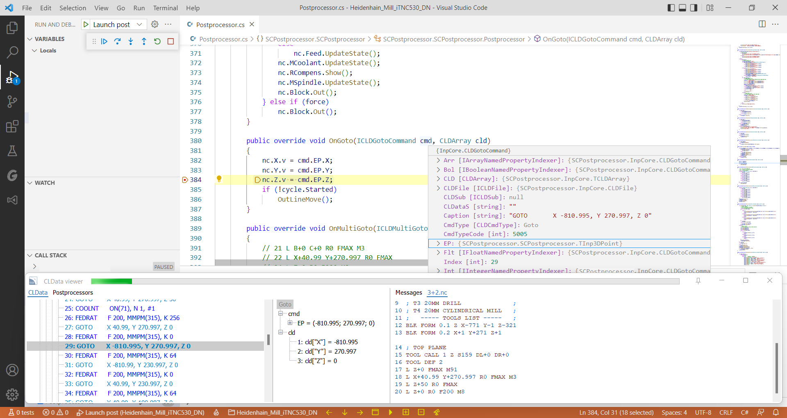

# Postprocessors' development tools
The **postprocessor** is a regular program module with the dll extension, so to be able to make your own postprocessors you should use program development tools.
In order to make the development of postprocessors widely accessible, simple and convenient, this system is built on the basis of well-known, free and convenient tools.

## .NET platform
The [.NET (dotnet) platform](https://dotnet.microsoft.com/en-us/) is a free, open-source and cross-platform toolkit that allows you to create various types of applications. To start building .NET apps you need to download and install the .NET SDK (Software Development Kit) — a set of utilities which helps you compile binary program modules from the source files, and also contains a rich set of standard libraries to simplify the process of program creation, because it provides a large number of ready-made solutions for performing routine tasks (working with files, strings, lists, etc.). .NET is a very flexible and extensible tool, as it allows you to easily include third-party libraries from the several million available in [the global nuget repository](https://www.nuget.org/). If you want to implement something ordinary (create a standard doc or pdf file, read a database file, create a beautiful html report, etc.), then with a high degree of probability someone else has already done it before you — just use it.

## Visual Studio Code
[Visual Studio Code](https://code.visualstudio.com/), also commonly referred to as VS Code, is a free, lightweight and powerful source-code editor made by Microsoft. Features include support for debugging, syntax highlighting, intelligent code completion, snippets, and code refactoring. Users can change the theme, keyboard shortcuts, preferences, and install extensions that add additional functionality. Visual Studio Code is one of the most popular developer environment tools around the world.

## C# programming language
The [`C#` (C-sharp) programming language](https://docs.microsoft.com/en-us/dotnet/csharp/) is a simple, modern, object-oriented, general-purpose programming language. It is in the top 5 languages according to generally recognized ratings (like TIOBE, PYPL). There is a huge amount of training material and answers to frequently asked questions on the network. To switch on support of `C#` in VS Code you need to [install](https://code.visualstudio.com/docs/languages/csharp) [the C# extension](https://marketplace.visualstudio.com/items?itemName=ms-dotnettools.csharp) from the marketplace.

## CLData Viewer
[CLData Viewer](../user-interface/cldata-viewer.md) is a window program, specially designed by the CAM developers for the purpose of debugging postprocessors. It allows you to view the toolpath from the CAM project in the form of a list of CLData commands and their parameters. Right during debugging the code of a postprocessor in VS Code, CLData Viewer tracks the output files in real time. It allows you to jump from a command to a line in the resulting output file and back. It supports CLData breakpoints, helps to create new postprocessors and edit their settings.

