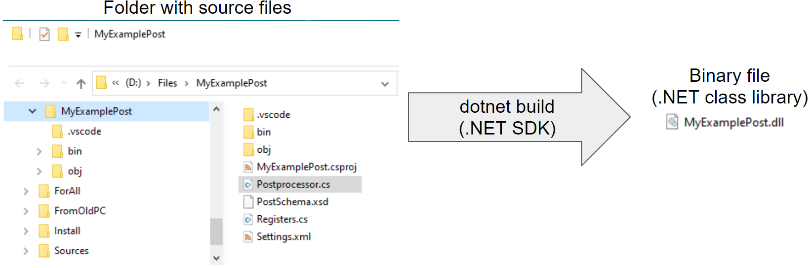

# Postprocessor's file set
Each postprocessor is a compiled program consisting of several files. All files related to one postprocessor are usually located in one folder. The set of files can be divided into two main parts.
- **Source code files** are text files containing program code that is written by the postprocessor developer using the `C#` programming language. Source files are only needed on the developer's side of the postprocessor. Usually they are not passed to the client (the one who will use the postprocessor to get the G-code).
- **Postprocessor binary file** with the *.dll extension, which is produced by the dotnet platform compiler based on the source files. The compiler usually produces many binaries, most of which are auxiliary in nature. There is only one main resulting binary dll file — the file whose name is the same as the postprocessor folder name (and also the *.csproj project file name). This file is self-sufficient for generating G-code, so only it needs to be passed to the client.

Let's take as an example the contents of a folder, which is a set of files of one postprocessor. Here blue color are folders, green color are source text files, red is the main resulting binary file, gray are auxiliary binary and text files.

- **MyExamplePost** — **the main folder of the postprocessor**. The name of this folder defines the name of the postprocessor. It should be the same as the name of the .csproj file (if you want to rename the post you should rename both — the folder and .csproj file).
    - MyExamplePost.csproj — `C#` project file of the postprocessor. It does not contain meaningful postprocessor code. It simply describes that it is a regular `C#` program. Usually you don't need to change anything in this file.
    - **Postprocessor.cs** — **the main source file of the postprocessor**. This is exactly the file that contains meaningful program code that determines the logic of the postprocessor. The developer should write their code here.
    - Registers.cs — an auxiliary source file which contains declarations of the registers (NCWords) that can be used to format and filter text before outputting it to G-code. Do not place meaningful code here, use it to declare registers only. You can change it manually or using the registers editing window of CLData Viewer.
    - Settings.xml — this file contains the descriptive properties of the postprocessor (authors, CNC and machine name), as well as a list of additional properties created by the developer, which are shown to the client when using the postprocessor and which they must fill in before starting the generation of G-code (for example, the output file name, program number, username, etc.). You should use the "Edit postprocessor XML settings" window of the CLData Viewer to change this file.
    - PostSchema.xsd — auxiliary file that describes the syntax rules for the Settings.xml file. It is needed for error highlighting and auto-completion when manually editing the Settings.xml file. You don't need to change the PostSchema.xsd file.
    - .vscode — the folder which contains settings for Visual Studio Code to automate the compilation and debug process of the postprocessor. Usually you don't need to change anything here.
        - launch.json — the file contains the shell command which should be executed to start debugging of the postprocessor when you press the "F5" key.
        - tasks.json — the file contains the shell command which should be executed to run building of the postprocessor when you press "Shift+Ctrl+B".
    - bin\Debug — this folder contains a few binaries automatically generated during compilation. If they are deleted, they will be automatically restored at the next compilation.
        - **MyExamplePost.dll** — it is **the main resulting self-sufficient output binary file** of the postprocessor. For the client, you must supply only this one file.
        - SCPostprocessor.dll — the standard CAM library which contains the common description of postprocessing types and classes. It is automatically copied from the CAM installation folder during build.
        - STDefLib.dll — the standard CAM library which contains common purpose helper functions which can be used by postprocessors. It is automatically copied from the CAM installation folder during build.
        - VecMatrLib.dll — the standard CAM library which contains helper functions to work with geometry which can be used by postprocessors. It is automatically copied from the CAM installation folder during build.
        - MyExamplePost.deps.json — this file describes which additional libraries the postprocessor depends on.
        - MyExamplePost.pdb — debug symbols file.
        - SCPostprocessor.pdb — debug symbols file.
        - STDefLib.pdb — debug symbols file.
        - VecMatrLib.pdb — debug symbols file.
        - SCPostprocessor.xml — tooltip documentation text file.
        - STDefLib.xml — tooltip documentation text file.
    - obj — autogenerated folder.
        - a lot of auxiliary autogenerated files. If they are deleted, they will be automatically restored at the next compilation.
