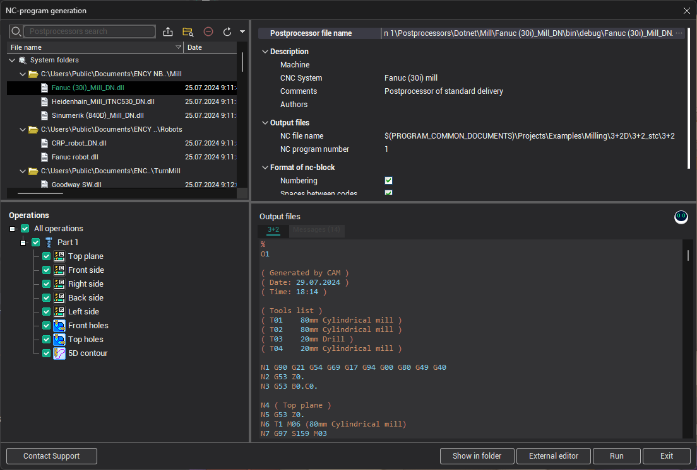
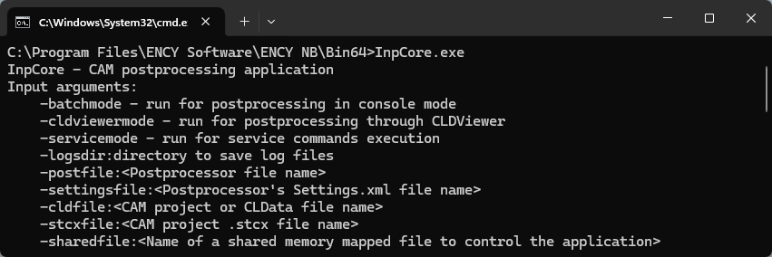
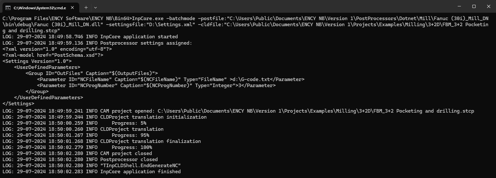
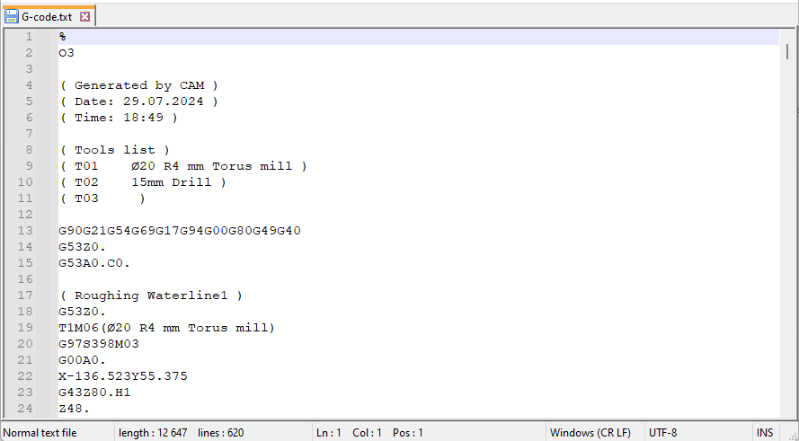

# Running the postprocessing
Let's see how to generate a G-code using the postprocessors.

## NC-program generation window
The first, simplest way is to use **the window of the CAM system** specially designed for this. You can open it using the "Postprocessor" button at the top toolbar of the main window.

Here you just need to choose the desired postprocessor in the left top list, then define some additional settings in the right top properties list like the output NC file name, for example, and, finally, click the "**Run**" button. At the bottom part of the window you will see the content of a generated G-code file. To get the file itself you can use the "**Show file in Windows explorer**" popup menu item of the panel with the G-code.

## Running of postprocessors in console mode
The postprocessing system is a **standalone program**, so you can also run it independently from the CAM system, the same way the CAM system does it behind the scenes.
To do it just run the standard Windows command prompt from the Start menu or "Win+R" keyboard shortcut and type "cmd". Here you need to type the path to the **InpCore.exe** utility from the CAM installation folder.
It will show you the welcome screen with the list of available parameters.

To generate a G-code you should specify the following parameters.
- "-batchmode" — to start standalone postprocessing without postprocessor debugging through the CLData Viewer.
- "-postfile:`<path to the postprocessor dll>`" — full path to the postprocessor's dll file you want to use.
- "-cldfile:`<path to the CAM project stcp>`" — full path to the CAM project stcp file which contains the toolpath you want to postprocess.
- "settingsfile:`<path to the postprocessor's settings.xml file>`" — the full path to the xml file, which should contain settings specific to a particular postprocessor. For example, inside it you can specify the output file name, G-code program number, employee name, etc.

Below is an example of postprocessing in console mode.

And the resulting G-code.

