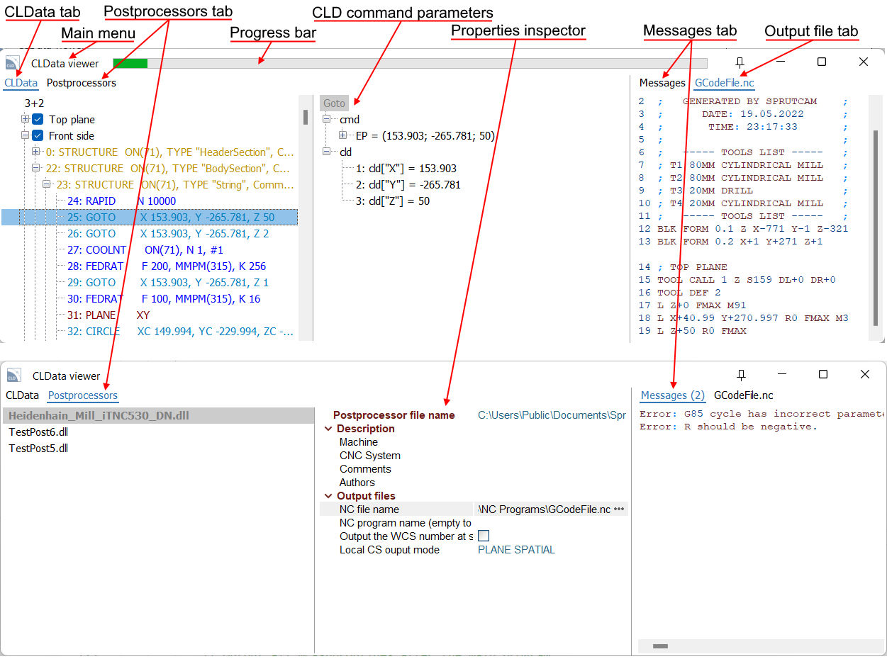
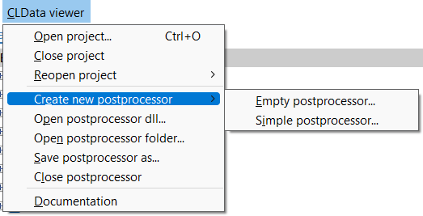
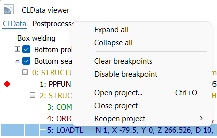
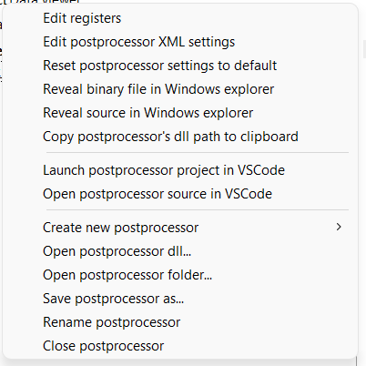
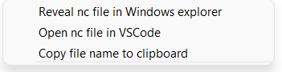

# CLData Viewer's main window

## CLData Viewer

CLData Viewer is a window program, specially designed by the CAM developers for the purpose of debugging postprocessors. It allows you to view the toolpath from the CAM project in the form of a list of CLData commands and their parameters. Right during debugging the code of a postprocessor in VS Code, CLData Viewer tracks the output files in real time. It allows you to jump from a command to a line in the resulting output file and back. It supports CLData breakpoints, helps to create new postprocessors and edit their settings.

The main window of the CLData Viewer contains the following items.
- **Main menu**. It contains the main actions you can do in the CLData Viewer like opening the projects and postprocessors.
- **CLData tab** — the list with the CLData commands of the currently opened CAM system's project. Use the popup menu to operate with projects and breakpoints on CLData commands.
- **CLD command** parameters panel shows the list of main parameters of the CLData command which is selected on the CLData tab. Using the popup menu of this panel, you can easily get the name of the parameter by which you can access it from the program code of the postprocessor.
- **Postprocessors tab** — the list of postprocessors opened in CLData Viewer. Here, the postprocessor that was debugged last in VS Code is highlighted in bold. Use the popup menu of this panel to perform actions on the postprocessors.
- **Properties inspector** shows the properties of the postprocessor which is selected on the postprocessors tab. Here you can define some values which will be the input for the postprocessor to generate the G-code output files. For example, it can be the name of the output file, program number, etc.
- **Output file tab** — shows the content of the output file (G-code).
- **Messages tab** — displays a list of messages (errors, warnings, infos) that the postprocessor generates during work.
- **Progress bar** — shows the progress of the postprocessing (what percentage of the total number of CLData commands has already been handled).

## Main menu

The main menu of CLData Viewer looks like the one shown in the picture below.

- **Open project...** — allows you to open the CAM system project (*.stcp file) with a CLData which will be used to debug postprocessors. A standard file open dialog will be shown.
- **Close project** — closes the opened CAM system project.
- **Reopen project** — shows the list of recently loaded CAM system projects to open them quickly.
- **Create new postprocessor** — helps to create a new postprocessor based on the selected template.
- **Open postprocessor dll..** — allows you to open an existing postprocessor in the CLData Viewer by choosing a *.dll file of this postprocessor. A standard file open dialog will be shown.
- **Open postprocessor folder..** — allows you to open an existing postprocessor in the CLData Viewer by choosing a folder of this postprocessor. A standard folder open dialog will be shown.
- **Save postprocessor as...** — here you can save the selected postprocessor with another name.
- **Close postprocessor** — removes the currently selected postprocessor from the list of postprocessors opened in CLData Viewer.
- **Documentation** — opens the online documentation of postprocessing.

## CLData tab

The CLData tab shows a tree with the CLData commands of the currently opened CAM system's project.

**Top level items** are so-called "CLData files" which can represent technological operations of the CAM system or CLD-subroutines.

**The nested nodes** are CLData commands which represent a toolpath of each operation, calculated by the CAM system. The color of the node denotes the command type. The currently postprocessed command when debug is in progress is shown in bold.
A detailed list of parameters for the selected command is shown on a separate panel to the right of the CLData list. Using the popup menu of this panel, you can easily get the name of the parameter by which you can access it from the program code of the postprocessor. Also you can copy to clipboard the value of any parameter.

**Double click** on a CLData command will show you the lines inside the output file which were generated by this command.

There is a concept of so-called "**CLData breakpoints**". By clicking on a gutter (free space to the left of the CLData commands) next to the desired command you can activate a special kind of breakpoint. It will be shown as a bold red point there. It means that the postprocessing should be paused before handling of this command and you can explore the process of program execution for this command in more detail.
This works in conjunction with the "**Function breakpoint**" feature of Visual Studio Code only. On the breakpoints panel ("Run and debug" tab) of Visual Studio Code you can add a new breakpoint and specify the name of the function you want to stop on. Here you should specify the special function name "**StopOnCLData**". In this case the postprocessing system will go into the function with such a name each time when it reaches the CLData command that is marked with a CLData breakpoint. Of course the program code of your postprocessor should have (override) the function with this name. By default any postprocessor already has it if you created it using standard templates.

The popup menu of the CLData tab looks like this one.

- **Expand all** — expands all CLData nodes in the tree.
- **Collapse all** — collapses all CLData nodes in the tree.
- **Clear breakpoints** — deletes all CLData breakpoints from CLData Viewer.
- **Disable breakpoint** — temporarily deactivates a CLData breakpoint on the selected command until you enable it again.
- **Open project...** — allows you to open the CAM system project (*.stcp file) with a CLData which will be used to debug postprocessors. A standard file open dialog will be shown.
- **Close project** — closes the opened CAM system project.
- **Reopen project** — shows the list of recently loaded CAM system projects to open them quickly.

## Postprocessors tab

The postprocessors tab allows you to view and edit parameters of several postprocessors opened in the CLData Viewer. The left part shows the list of postprocessors, the right part shows an inspector with parameters of the selected postprocessor.
The postprocessor that was debugged last in Visual Studio Code is highlighted in bold in the list.

You should use the popup menu to perform actions on the postprocessors.

- **Edit registers** — opens [the window to edit the registers list](registers-windows.md) of the selected postprocessor.
- **Edit postprocessor XML settings** — opens [the window to edit the list of settings](postprocessor-settings-window.md) of the selected postprocessor.
- **Reset postprocessor settings to default** — restores the default value for each parameter of the selected postprocessor which is defined in the "**settings.xml**" file of it. When you type some values in the inspector of properties (for example an output file name) it affects the debug process only and is not saved inside the postprocessor itself. To change the default values use [the window to edit the list of settings](postprocessor-settings-window.md) or edit the file manually.
- **Reveal binary file in Windows explorer** — opens the Windows explorer in the folder where the resulting binary ***.dll** file of the postprocessor is placed and selects it.
- **Reveal source in Windows explorer** — opens the Windows explorer in the folder where the source code **Postprocessor.cs** file of the postprocessor is placed and selects it.
- **Copy postprocessor's dll path to clipboard** — copies to clipboard the path to the resulting binary ***.dll** file of the selected postprocessor.
- **Launch postprocessor project in VSCode** — starts Visual Studio Code (or activates an existing window) and opens the folder of the selected postprocessor in it. After that you can run and debug it. Or alternatively you can just double click on the postprocessor to do the same.
- **Open postprocessor source in VSCode** — starts Visual Studio Code (or activates an existing window) and opens the source code file **Postprocessor.cs** of the selected postprocessor in it as an auxiliary additional file tab exactly. It does not close the project currently opened in VS Code, so it will not allow you to run and debug this postprocessor (because you should open it as a folder to be able to debug), but you can view it. It can be useful when you want to compare the source code of several postprocessors and copy it from one to another.
- **Create new postprocessor** — helps to create a new postprocessor based on the selected template.
- **Open postprocessor dll..** — allows you to open an existing postprocessor in the CLData Viewer by choosing a *.dll file of this postprocessor. A standard file open dialog will be shown.
- **Open postprocessor folder..** — allows you to open an existing postprocessor in the CLData Viewer by choosing a folder of this postprocessor. A standard folder open dialog will be shown.
- **Save postprocessor as...** — here you can save the selected postprocessor with another name.
- **Rename postprocessor** — allows you to easily and safely rename the selected postprocessor.
- **Close postprocessor** — removes the currently selected postprocessor from the list of postprocessors opened in CLData Viewer.

## Output files and messages tabs

These tabs can show you the results of work after the run of a postprocessor in Visual Studio Code.
- **Output file tab** — shows the content of the output file (G-code). There may be several file tabs if the postprocessor generates many files at the same time. It updates dynamically while the postprocessor is running and debugging. Double click on a line in the file will show you the CLData command which generated this line.
- **Messages tab** — displays a list of messages (errors, warnings, infos) that the postprocessor generates during work.

The popup menu of this panel contains the following items.

- **Reveal nc file in Windows explorer** — opens the Windows explorer in the folder where the resulting output file is placed and selects it.
- **Open nc file in VSCode** — starts Visual Studio Code (or activates an existing window) and opens the resulting output file in it as an auxiliary additional file tab. It does not close the project currently opened in VS Code.
- **Copy file name to clipboard** — copies the name of the selected file with full path to clipboard.
