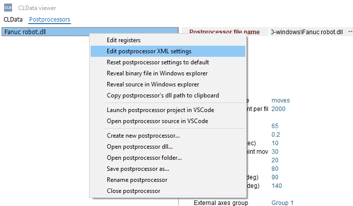
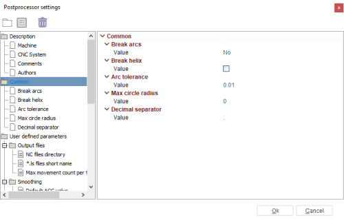
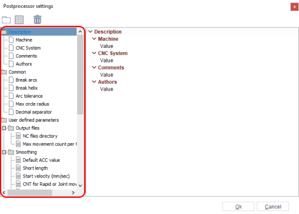
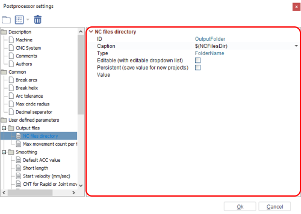
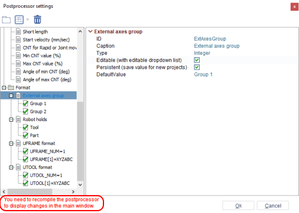

# Postprocessor settings window


## What are settings?
Each postprocessor has some set of parameters which we can divide into three main groups.
1. **Descriptional** properties like Machine and CNC system name, comments and list of authors.
2. **Common** properties which define the way how to handle some frequently encountered cases. For example, should it break circular arc movements into lines, halves or quarters.
3. **User defined parameters** — they are a list of additional properties designed by the developer of an exact postprocessor, which are shown to the user of the postprocessor and which they must fill in before starting the generation of G-code. For example, the path to an output file, program name or number, employee name, etc.

The postprocessor stores its settings in a separate **settings.xml** file which is placed in the folder of source files next to the main postprocessor.cs file. When compiling, this file is embedded inside the main binary dll file of the postprocessor.

## Example of Settings.xml file content

Below is an example of the content of a settings.xml file for a real **Fanuc robot** postprocessor.


<details open>
<summary><span style="color:green"><b>Settings.xml</b></span> — click to expand.</summary>

```xml
<?xml version="1.0" encoding="utf-8"?>
<?xml-model href="PostSchema.xsd"?>
<Settings Version="1.0">
  <Description>
    <Comments />
    <CNCSystem />
    <MachineName />
    <Authors />
  </Description>
  <Common>
    <BreakArcs>No</BreakArcs>
    <!-- No, Cuts, Halfs, Quaters -->
    <BreakHelix>false</BreakHelix>
    <!-- false, true -->
    <ArcTolerance>0.01</ArcTolerance>
    <MaxCircleRadius>0</MaxCircleRadius>
    <DecimalSeparator>.</DecimalSeparator>
  </Common>
  <UserDefinedParameters>
    <Group ID="OutFiles" Caption="$(OutputFiles)">
      <Parameter ID="OutputFolder" Caption="$(NCFilesDir)" Type="FolderName" />
      <Parameter ID="LSFileName" Caption="*.ls files short name" Type="String">moves</Parameter>
      <Parameter ID="MaxMoveCount" Caption="Max movement count per file" Type="Integer">2000</Parameter>
    </Group>
    <Group ID="Smoothing" Caption="Smoothing">
      <Parameter ID="DefaultACC" Caption="Default ACC value" Type="Integer">65</Parameter>
      <Parameter ID="ShortLength" Caption="Short length" Type="Double">0.2</Parameter>
      <Parameter ID="StartVelocity" Caption="Start velocity (mm/sec)" Type="Double">10</Parameter>
      <Parameter ID="CntValueRapid" Caption="CNT for Rapid or Joint move (%)" Type="Integer">30</Parameter>
      <Parameter ID="CntValueMin" Caption="Min CNT value (%)" Type="Integer">20</Parameter>
      <Parameter ID="CntValueMax" Caption="Max CNT value (%)" Type="Integer">80</Parameter>
      <Parameter ID="AngMin" Caption="Angle of min CNT (deg)" Type="Integer">90</Parameter>
      <Parameter ID="AngMax" Caption="Angle of max CNT (deg)" Type="Integer">140</Parameter>
    </Group>
    <Group ID="Format" Caption="Format">
      <Parameter ID="ExtAxesGroup" Caption="External axes group" Type="Integer">
        <Value Caption="Group 1" Default="true">1</Value>
        <Value Caption="Group 2">2</Value>
      </Parameter>
      <Parameter ID="RobotHolds" Caption="Robot holds" Type="Integer">
        <Value Caption="Tool" Default="true">0</Value>
        <Value Caption="Part">1</Value>
      </Parameter>
      <Parameter ID="UFrameFormat" Caption="UFRAME format" Type="Integer">
        <Value Caption="UFRAME_NUM=1" Default="true">0</Value>
        <Value Caption="UFRAME[1]=XYZABC">1</Value>
      </Parameter>
      <Parameter ID="UToolFormat" Caption="UTOOL format" Type="Integer">
        <Value Caption="UTOOL_NUM=1" Default="true">0</Value>
        <Value Caption="UTOOL[1]=XYZABC">1</Value>
      </Parameter>
    </Group>
  </UserDefinedParameters>
</Settings>
```

</details>

Of course, you can edit this file manually inside Visual Studio Code. The **PostSchema.xsd** file even contains the syntax rules which will give you error highlighting and predefined words autocompletion for this purpose. But inside CLData Viewer we have a window which is specially designed to edit the settings.

## Postprocessor settings window

The postprocessor settings window allows you to work with the xml settings of a postprocessor in the most convenient way. In order to open the window, you need to select a postprocessor in CLData Viewer and right-click on it. After that click on **Edit postprocessor XML settings** in the context menu.



The postprocessor settings window displays parameters in the form of a visual tree of nodes and the properties inspector.

**Postprocessor settings window**:



## Control elements
The tree element control panel is in the upper left part of the window. There are 3 controls on the panel:


1. **Add group** — adds a user group to the selected folder of the **User defined parameters** section and in its root;
2. **Add parameter or enum value** — adds a user parameter to the selected folder of the **User defined parameters** section and in its root. There are 7 variants to add a parameter:
   1. **String parameter**;
   2. **Integer parameter**;
   3. **Double parameter**;
   4. **Boolean parameter**;
   5. **FileName parameter**;
   6. **FolderName parameter**;
   7. **Enum value** — this value is added only to the selected parameter of **User defined parameters**.
3. **Delete item** — deletes the user-selected item in the elements tree.

## Elements of tree
On the left part of the window there is a tree with default parameters and user parameters.



Tree display:
1. **Section/folder** — ;
2. **Default parameter** — ;
3. **User parameter** — ;
4. **Enum value** — ;
### Default parameters
The **Description** section and **Common** section are default and parameters within them cannot be edited, added or deleted. It is only allowed to enter the parameter value.
The **Description** section stores string parameters to describe the postprocessor. It has 4 parameters:
1. **Machine**;
2. **CNC System**;
3. **Comments**;
4. **Authors**.

The **Common** section stores parameters to set the default settings for the postprocessor. It has 5 parameters:
1. **Break arcs** — allows you to set the breaking arcs mode. It has the following values:
   1. **No** — without breaking;
   2. **Cuts** — with breaking;
   3. **Halves** — breaking an arc in half;
   4. **Quarters** — breaking an arc in quarters;
2. **Break helix** — allows you to enable or disable the breaking helix mode;
3. **Arc tolerance** — setting arc tolerance as a double value;
4. **Max circle radius** — setting the maximum circle radius as a double value;
5. **Decimal separator** — available values: "**.**" and "**,**".
### User parameters
The user can create their own parameters and store them in their own folders in the **User defined parameters** section. Folders can be stored in other folders. You can use **drag-n-drop** to move parameters and folders but an **Enum value** can be moved only in the current parameter.
## Attributes of elements panel
The attributes of elements panel is on the right side of the window.



In the case of default parameters, you can only enter their values in this panel. In the case of user parameters, you can do full customization.

Each user element has a **Caption** attribute. You can set your own caption but there are several reserved variables to specify the caption:
1. **$(OutputFiles)**;
2. **$(NCFileExt)**;
3. **$(NCFileName)**;
4. **$(NCFilesDir)**;
5. **$(NCProgNumber)**.
These variables allow you to make a translatable name (localization). Also they allow generating some default values depending on the meaning of the parameter, for example, NC files are stored by default in the folder specified in the CAM system settings.

A user folder element has an **ID** attribute: a unique identifier of the element.

A user parameter element has the following attributes:
1. **ID** — unique identifier of the element;
2. **Type** — type of the parameter. There are several values:
   1. **String** — parameter with a string value;
   2. **Integer** — parameter with an integer value;
   3. **Double** — parameter with a double value;
   4. **Boolean** — parameter with a boolean value, check box;
   5. **FileName** — parameter with a dialog box for searching and specifying the path of files in the parameter value;
   6. **FolderName** — parameter with a dialog box for searching and specifying the path of a folder in the parameter value.
3. **FilesFilter** — file extension to search and open in the dialog box. Only for **Type**=**FileName**;
4. **Editable (with editable dropdown list)** — allows you to edit an existing enum value and add a new value;
5. **Persistent** — saves the value for new projects;
6. **Value** — parameter value according to its type;
7. **DefaultValue** — default value for a parameter that has enumerated values, dropdown list.

An enum value element has a **Value** attribute. The type of value is the same as the parent parameter.

## Saving changes
After each change and move of a parameter, a warning will appear in the lower left part of the window: "You need to recompile the postprocessor to display changes in the main window".



In order for the changes to be saved in the xml file, you need to click the **Ok** button.

The main window of CLData Viewer shows the settings which are embedded into the dll file of the postprocessor, but not the source xml file. So you should rebuild the postprocessor in Visual Studio Code to see the result of editing in the main window.

It is also sometimes useful to reset the settings to the default state because CLData Viewer also stores the values you specify in the main window for debug purposes in a separate temporary file. To do this just use the **Reset postprocessor settings to default** popup menu item of the postprocessor or properties inspector.

## Accessing settings from C# code

Below is an example of how to get access to the settings from the `C#` code of a postprocessor using the **Settings** and **Settings.Params** properties of the **Postprocessor** class:

```csharp
void StartNewFile() {
    ls = new LSFile();
    ls.Name = Settings.Params.Str["OutFiles.LSFileName"];
    ls.OutputFileName = Settings.Params.Str["OutFiles.OutputFolder"] + @"\" + ls.Name + ".ls";

    unitsAreInches = prj.Int["Units"]>0;
    MaxMoveCount = Settings.Params.Int["OutFiles.MaxMoveCount"];

    smooth.accDefaultValue = Settings.Params.Int["Smoothing.DefaultACC"];
    smooth.ShortLength = Settings.Params.Flt["Smoothing.ShortLength"];
    smooth.StartVelocity = 60*Settings.Params.Flt["Smoothing.StartVelocity"];
    smooth.cntValueRapid = Settings.Params.Int["Smoothing.CntValueRapid"];
    smooth.cntValueMin = Settings.Params.Int["Smoothing.CntValueMin"];
    smooth.cntValueMax = Settings.Params.Int["Smoothing.CntValueMax"];
    smooth.angMin = Settings.Params.Int["Smoothing.AngMin"];
    smooth.angMax = Settings.Params.Int["Smoothing.AngMax"];
}
```
