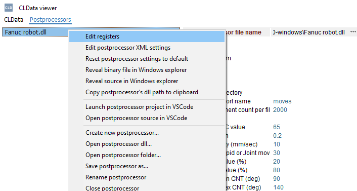
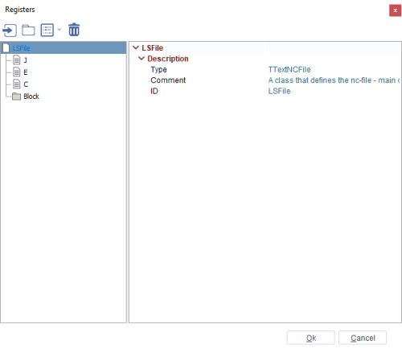
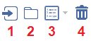
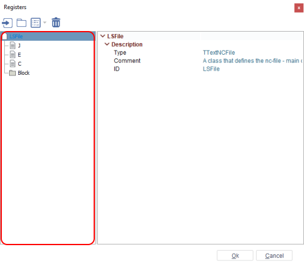
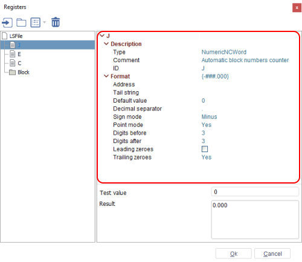
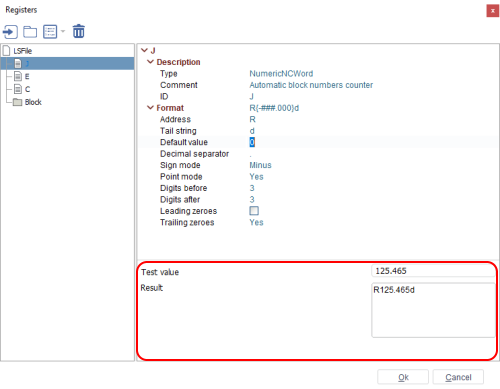
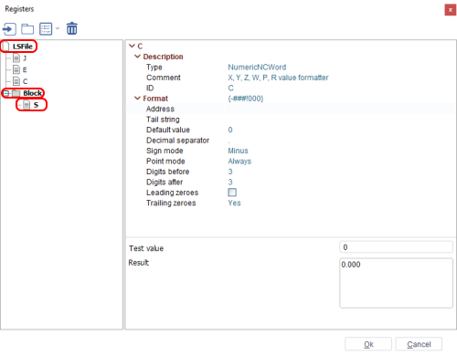

# Registers window
The registers window allows you to work with registers. In order to open the window, you need to select a postprocessor in CLData Viewer and right-click on it. After that click on **Edit registers** in the context menu.



The registers window displays **registers**, **blocks** and **files** that are stored in the **Registers.cs** file of the postprocessor. The window allows you to edit **registers**, **blocks** and **files** more conveniently.

**Registers window**:



**Registers.cs** file:

```csharp
// This file may be autogenerated, do not place meaningful code here.
// Use it only to define a list of nc-words (registers) that may appear
// in blocks of the nc-file.
namespace DotnetPostprocessing.SDK
{
    ///<summary>A class that defines the nc-file - main output file that should be generated by the postprocessor.</summary>
    public partial class LSFile: TTextNCFile
    {
        ///<summary>The block of the nc-file is an ordered list of nc-words</summary>
        public NCBlock Block;

        ///<summary>Automatic block numbers counter</summary>
        // public CountingNCWord BlockN = new CountingNCWord("N{######}", 1, 1, 1);

        ///<summary>Joint value formatter</summary>
        public NumericNCWord J = new NumericNCWord("{-000.000}", 0);

        ///<summary>External axis value formatter</summary>
        public NumericNCWord E = new NumericNCWord("{-####.000}", 0);

        ///<summary>X, Y, Z, W, P, R value formatter</summary>
        public NumericNCWord C = new NumericNCWord("{-000!000}", 0);

        public LSFile(): base()
        {
            Block = new NCBlock(this);
            OnInit();
        }

    }
}
```
## Control elements
The tree element control panel is in the upper left part of the window. There are 4 controls on the panel:


1. **Add file** — adds a new output file class;
2. **Add block** — adds a new block that can store registers;
3. **Add register** — adds a user register to the selected block or file. There are 4 variants to add a register:
   1. **Numeric register** — register that stores a numeric value;
   2. **Counting register** — register that stores a numeric value that can be incremented;
   3. **Text register** — register that stores a string value;
   4. **Registers of current file**. This variant allows you to move an existing register to the selected item (file or block). If a register is moved to a file then it is removed from the block in which it was located. If a register is moved to a block then it is removed from the file in which it was located. But if it was in another block, then the register is moved to the selected block without deletion.
4. **Delete item** — deletes the selected item in the elements tree.
## Elements of tree
On the left part of the window there is a tree with a list of **registers**
, **blocks**
 and **files**
.



Registers can be located in a file or a block. You can move registers between blocks in a file. A register is moved by **Drag'n'Drop**. A register can be located either only in the root of the file or in one or more blocks of the given file. You need to move with the **Ctrl** button pressed to copy a register from one block to another.
Each element of the tree has its own parameters.
## Parameters of elements panel
The parameters of elements panel is on the right side of the window.


There are different parameters for each type of element.
### Parameters of file element
A file element has the following parameters:
1. **Type** — type of the output file class:
   1. **TTextNCFile** — the main class to use for writing text files;
   2. **TSimpleTextNCFile** — simplest implementation of the output file;
2. **Comment** — hint comment for the file;
3. **ID** — unique name of the file class.
### Parameters of block element
A block element has the following parameters:
1. **Comment** — hint comment for the block;
2. **ID** — unique name of the block class.
### Parameters of register element
A register element has the following parameters:
1. **Type** — type of the register class:
   1. **CountingNCWord** — it's a **NumericNCWord** that automatically increments or decrements the value of the register with the defined step after each call of Out() or Form();
   2. **NumericNCWord** — type that converts numeric values to a text format;
   3. **TextNCWord** — type that converts string values to a text format;
2. **Comment** — hint comment for the register;
3. **ID** — unique name of the register class;
A register element has an additional section. It's the format. You can enter the output format in the right part of the format line using reserved characters. After entering parameters, parameters inside the format section are changed in accordance with the entered format string inside. And vice versa, when you change parameters inside the format section, the format string changes.
Each type of register class has its own parameters in the format section.
#### Format parameters of NumericNCWord register
The **NumericNCWord** register has its own parameters:
1. **Address** — the symbols which will be written in the NC-program block before the register value;
2. **Tail string** — the symbols which will be written in the NC-program block after the register value;
3. **Default value** — default value of the current register;
4. **Decimal separator** — using "." or "," as the decimal separator;
5. **Sign mode** — defines the output mode for the sign of the register value. The following options are available:
    1. **No** — sign is not output;
    2. **Minus** — only minus is output;
    3. **Plus and minus** — plus and minus are output;
6. **Point mode** — output decimal separator. This field can have the following values:
    1. **No** — decimal separator is not output;
    2. **Yes** — decimal separator will be output if the register value has a fractional part;
    3. **Always** — decimal separator will be output anyway;
7. **Digits before** — maximum quantity of signs in the whole part of the number;
8. **Digits after** — maximum quantity of signs in the fractional part of the number;
9.  **Leading zeroes** — defines the zeroes output mode before the register value;
10. **Trailing zeroes** — defines the zeroes output mode after the register value.
#### Format parameters of CountingNCWord register
The **CountingNCWord** register has the same parameters as the **NumericNCWord** register but has its own additional parameters:
1. **Auto increment step** — the number by which the output value of the register will be increased;
2. **Frequence** — output the value of the register with the specified frequency. For example output every third value (**Frequence** = 3);
3. **Preserve indent** — aligns all numeric values by the value with the most count of characters.
#### Format parameters of TextNCWord register
The **TextNCWord** register has its own parameters:
1. **Address** — the symbols which will be written in the NC-program block before the register value;
2. **Tail string** — the symbols which will be written in the NC-program block after the register value;
3. **Default value** — default value of the current register;
4. **Text case** — case of the register value. This parameter has three values:
   1. **Original** — output value in its initial state;
   2. **Lower** — output value in lower case;
   3. **Upper** — output value in upper case.
## Test panel
The test panel is located below the parameters of elements panel. The test panel is displayed only for register elements.


There are 2 fields on this panel:
1. **Test value** — value that will be output based on the specified format;
2. **Result** — example of displaying the entered value based on the specified format. Five values are displayed for the register, since this register is incremented with each value.
## Saving changes
Each change, addition, removal and movement of elements is displayed on the panel. This element and its parents will be bolded.



In order to save all the entered changes in the register window, you need to click the **Ok** button. After that the file will be rebuilt and all data from the window will be entered into this file.

```csharp
// This file may be autogenerated, do not place meaningful code here.
// Use it only to define a list of nc-words (registers) that may appear
// in blocks of the nc-file.
namespace DotnetPostprocessing.SDK
{
    ///<summary>A class that defines the nc-file - main output file that should be generated by the postprocessor.</summary>
    public partial class LSFile : TTextNCFile
    {
        ///<summary>The block of the nc-file is an ordered list of nc-words</summary>
        public NCBlock Block;
        ///<summary></summary>
        public NumericNCWord S = new NumericNCWord("S{-###.###}", 0);
        ///<summary>Automatic block numbers counter</summary>
        public NumericNCWord J = new NumericNCWord("{-###.000}", 0);
        ///<summary>External axis value formatter</summary>
        public NumericNCWord E = new NumericNCWord("{-####.000}", 0);
        ///<summary>X, Y, Z, W, P, R value formatter</summary>
        public NumericNCWord C = new NumericNCWord("{-###!000}", 0);
        public LSFile(): base()
        {
            Block = new NCBlock(
                  this,
                  S);
            OnInit();
        }
    }
}
```
