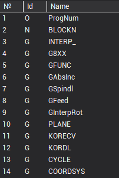
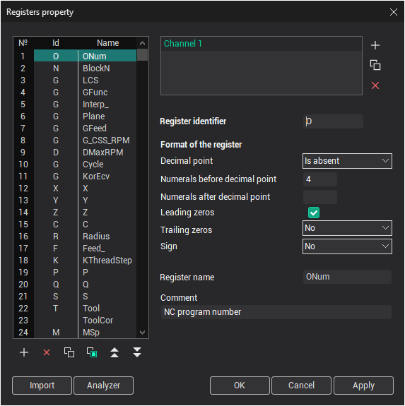
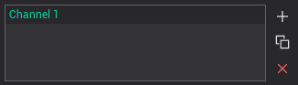

# The block structure and format definition (Register list forming)

To define the structure and the format of a block, it's necessary to form the list of the registers and to define their parameters.

Block of NC program consist of words. Each word contains address and value. **Address** – letter (sometimes several letters), **Value** – is number present in definite format. The determined **Register** is connected to each address in the postprocessor.

The concept of the **Register** of the postprocessor integrates following properties:

- the identifier of the register (the address in a NC program);
- the format of an output of a value of this address in block;
- current value conforming to the address;
- the previous value conforming to the address;
- a name of the register (post-processor variable associated with the address for accessing both the current and the previous value of the register).

The NC-program blocks are formed automatically when the [OUTBLOCK](../../language-description/operators/block-output-statement-outblock.md) and [FORMBLOCK](../../language-description/operators/block-forming-statement-formblock.md) statements are performed. The NC-program block is formed by the system according to the following algorithm. The system examines the registers sequentially; if the current register value differs from its previous value, then the register will be written in the block and its current value will be assigned to its previous value, else the register will not be written in the block.

When the system writes the register in the NC-program block, it writes the register identifier first, and then it writes the register value. The value will be written in the block according to the format, described for this register (the length and the precision of the register value, the presence of decimal point, of sign and of leading and insignificant zeroes).

Thereby, to define the structure and the format of the block, it is necessary to fill the registers list and define the registers properties. The registers must be placed in the list in this order, in which they and their values must appear in the blocks of NC-program. This rule is correct for the processing programs. If the block is formed with, the mask using then the sequence corresponds to the mask.

Note: Different registers must not have same names, but they may have the same identifiers (the symbols, which will be written in the block before the value of register). This allows creating the separate register for each group of the functions with some type.

For example, we create the register with the name **ABSOLUTE** and with the **G** identifier for the preparative function of the switching between the absolute/incremental coordinate systems. Suppose also, we create the register with the name **INTERP** and the same identifier **G** for preparative function of positioning, linear interpolation, circular interpolation with direction. This allows us: firstly, to write both these commands in the same block of NC-program, if it is necessary, (for example, `N190 G91 G1 X50 Y30`). Secondly, to trace the current transitions mode (positioning, linear or circular interpolation with direction), to determine the current coordinate system (absolute or incremental) by examining the current values of registers **ABSOLUTE** and **INTERP**.

The list of registers is shown in the left part of main window.



The register properties edit window is opened when the register is added, when the item **Properties** in the context popup menu is selected or by double-clicking by left mouse button on the register in the list.



Register list is shown at the left part of window. Edit list buttons place below:

-  – inserts the new register after selected one, the window to edit the properties of a new register will be opened automatically;
-  – deletes selected register;
-  – copies the selected register into the clipboard;
-  – inserts the register from the clipboard after the selected one. The window to edit the properties of inserted register will be opened automatically;
-  – move the current register up on a list;
-  – move the current register down on a list.

To change the position of the register in the list, it is necessary to press the left mouse button on the register and drag it in the desired position, holding the left mouse button down.

If you have a multi-channel machine, you can control the registers of a specific channel by selecting it in the channel list.



You can also manually add channels , copy from an existing channel to a new one , or delete the current channel .

Following fields can be defined in this window:

- **Register identifier** – the symbols, which will be written in the NC-program block before the register value.
- **Decimal point** – this field can have following values:
  - **Is absent**;
  - **Is present** – if this item is chosen, then the decimal point will be present, if the register value has fractional part;
  - **Is present anyway**.

- **Numerals before decimal point** – maximum quantity of signs in the whole part of number.
- **Numerals after decimal point** – maximum quantity of signs in a fractional part of number.
- **Leading zeroes** and **Non-significant zeroes** – defines the zeroes output mode before and after the register value.
- **Sign** – defines the output mode for the sign of the register value. Following options are available:
  - **No**;
  - **"-" only**;
  - **"+" and "-" always**;

- **Register name** – the name of the register, which is used by the command processing programs.
- **Comment** – comments to register.

The **Import** button is intended for import of a list of registers from postprocessors of **SPPX**, **SPP** and **PPP** (the format of the old version), and as from SurfCam postprocessors.

For forming a list of registers based on a NC program, the **Analyzer** button is intended. Thus the text of the indicated NC program and all retrieved addresses is analyzed are added in a list of registers.

The **OK** button closes the window and saves all modifications. The **Cancel** button closes the window and discards all modifications. The **Apply** button save all changes, window of registers is not closed.

The current value of any register is available from program code by register's name as a usual variable. To get previous value of the register you need to write the name of register with @ char. For example:

```
program AbsMov
  Len1: Real
  Len1 = sqr((X-X@)^2 + (Y-Y@)^2 + (Z-Z@)^2) ! Here X, Y and Z are current values of registers, X@, Y@ and Z@ are previous values of registers
end
```

Also you can get access to the registers from program code with **RGS** operator in form of Rgs[**Index in list**] or Rgs["RegisterName"]. For example for exact list of registers that shown on the picture above:

```
program AbsMov
  Len1: Real
  Len1 = sqr((Rgs[3]-Rgs[3]@)^2 + (Rgs[4]-Rgs[4]@)^2 + (Rgs[5]-Rgs[5]@)^2) ! Here Rgs[3] is the current value of the register X, Rgs[3]@ is the previous value of register X
end
```

The full syntax that can be used with **RGS** operator listed below. Inside square brackets you can use index of the register in list (numerical constant or variable) or name of the register (string literal constant or variable).

- `RGS.ItemCount` - returns count of the registers in the list.
- `Rgs[<Index or Name>].STR` - string ID of the register which is used from G code side.
- `Rgs[<Index or Name>].NAME` - string name of the register which is used from postprocessor's code side.
- `Rgs[<Index or Name>]` or equivalent `Rgs[<Index or Name>].DATA` - current value of the register.
- `Rgs[<Index or Name>]@` or equivalent `Rgs[<Index or Name>].OLDDATA` - previous value of the register.
- `Rgs[<Index or Name>].NUM` - returns the index of the register in the list of registers.

Example that shows advantages of using **RGS** instead of name of the register is below.

```
program AbsMov
  ToolAxisIndex: Integer
  case PlaneGNumber of ! Remember tool axis register index depend on current plane
    17: ToolAxisIndex = Rgs["Z"].Num
    18: ToolAxisIndex = Rgs["Y"].Num
    19: ToolAxisIndex = Rgs["X"].Num
  end
  X = CLD.X ! Fill X, Y and Z registers' current value from CLDATA
  Y = CLD.Y
  Z = CLD.Z
  if Interp=0 then begin ! If we have rapid G0 movement case only let's we want make safe moving down
    if Rgs[ToolAxisIndex] < Rgs[ToolAxisIndex]@ then begin ! If the tool is moving down
      Rgs[ToolAxisIndex]@ = Rgs[ToolAxisIndex] ! Then we prevent output of tool axis movement
      OutBlock ! So here we output movements in active plane only
      Rgs[ToolAxisIndex]@ = 999999 ! Now we must assign any unmatched number to the old value of the register to
    end ! provide guaranteed output of movement along tool axis on the next OutBlock
  end
  OutBlock ! Output movement to the G code
end
```

**See also**

[The main window](readme-main-window.md)
