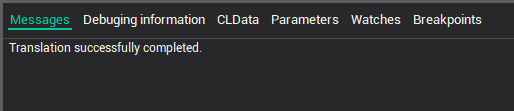

# The command processing programs compilation

The compilation can be running by pressing the  button on the [main toolbar](main-toolbar.md) or by pressing the [Ctrl-F9] combination.

Note: The activated program is compiled only.

The system messages about the compilation process are outputted in the messages page in the bottom part of the main window.

Errors occurring as a result of program translation are added to the system message list with the prefix [Error]. Double-clicking the left mouse button on such a message will load the original program text and set the cursor to the error position.

**See also**

[The main window](readme-main-window.md)
