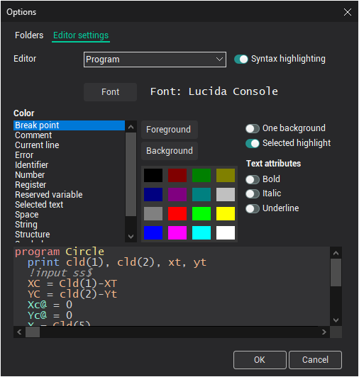

# Editor settings

Programs of technological commands consist of identifiers, the numbers, identifying reserved variables and functions, commenting etc. For each of these element blocks it is possible to adjust the color and type style, a background color.

An editor settings window can be activated from main menu. In a window, the font and illumination of syntax for the editor of programs of technological commands, windows of a text mapping of CLData files and windows of map of a NC-program adjusted.

For definition of customizations in a falling out list **Editor**, it is necessary to select one of editors: **Program**, **CLData** or the **NC program**. For the selected editor on the panel **Font** sets a name and a font size.

On the **Color** panel for each element block it is possible to assign color of the text, a background color of the text, type style.

For fast discoloration of a background of all element blocks, there is a check box **One background**. At selecting check box, the background color of all groups is substituted on a background color of a current element.

**Selected highlight** feature will highlight selected word throughout the editor.

The **OK** button closes the window and saves all modifications. The **Cancel** button closes the window and discards all modifications.

**See also**

[The main window](readme-main-window.md)
