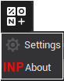
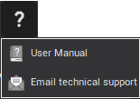

# The main toolbar

-  – Creates the new postprocessor's tuning file. The system resets its state before creation.
-  – Opens the postprocessor's tuning file, which is saved earlier. The system resets its state before loading.
-  – Saves the postprocessor's tuning file with the current name.
-  – Requests new CLData files from CAM system.
-  – Opens the technological commands file, generated by CAM system.
-  – Runs the compilation of the command processing programs.
-  – Runs the generation of the NC-program from the files of the tool motion trajectory. If the command processing programs aren't compiled, the compilation will be activated first.
-  – Break NC-program generation.
-  – Generate NC-program with stopping in subprograms.
-  – Generate NC-program without stopping in subprograms.
-  – Generate NC-program up to current position in a CLData.
-  – Pause NC-program generation.
-  – Add breakpoint in a handler of technological commands or CLData files.
-  – Adds a new variable to the list of watches.
-  – Compute variable or expressions. The evaluation is possible only in a debug mode.
-  – Cancel the last change made in the program of a handler technological command or a mask.
-  – Return the last change made in the program of a handler of a technological command or a mask.
-  – Opens the window for the data about NC-machine and CNC-system.
-  – Open transliteration properties dialog. Application toolbar placed on the top left panel of the main window. There are drop-down menus associated with 2 buttons.

-  – Opens system setup window.
-  – Information about Postprocessors generator.

Help menu consist of actions that allow to get answers to emerging questions.

-  – Shows postprocessors generator help.
-  – Prepare a message to the technical support service of the CAM system vendor.

**See also**

[The main window](readme-main-window.md)
