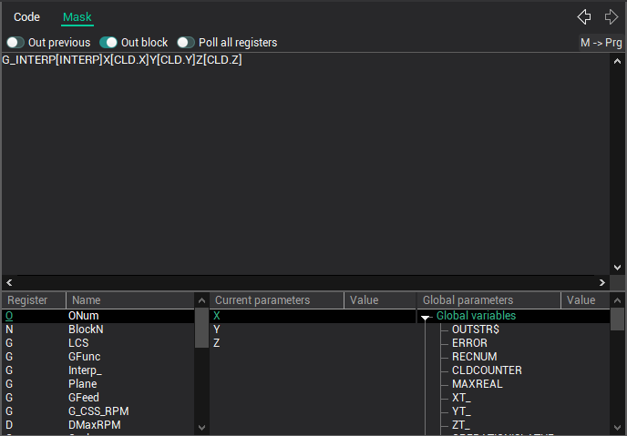
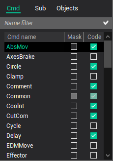

# The masks for the machining commands translation

The usage of the masks allows defining the transformation method from the CLData machining commands to the NC code line quickly and simply. Any CLData command has the corresponding mask, in which the words and the values for the words are defined.

The mask editor is located on the **Masks** page.

For the simplifying the process of the mask definition there are the registers list, current command parameters list and the global variables list in the bottom part of window. The double click on any element of these lists inserts the element to the mask text. Above the mask text field is located a checkbox panel that controls the mask processing.

The mask activating is performed by the tick setting on the CLData commands list.

The masks definition rules is described in details in the [Postprocessor masks](../../postprocessor-masks/readme-postprocessor-masks.md) chapter.

CLData commands that are not handled by this postprocessor can be hidden by selecting the appropriate item from the popup menu.

**See also**

[The main window](readme-main-window.md)
