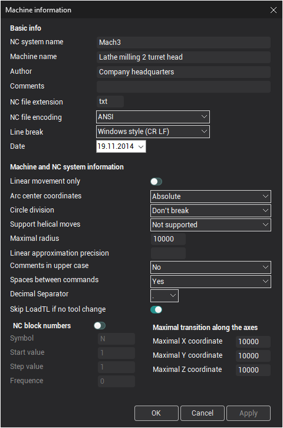
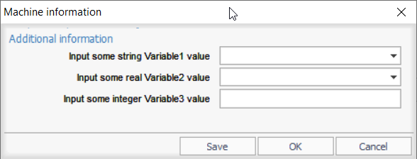

# Postprocessor parameters inquiry while the first using

Sometimes a dealer does not know some specific information about the user machine. It is possible to make the data inquiry. In this case the user will be asked about the NC-system information and inputted data will be saved in the postprocessor file.

An *.sppx file of a postprocessor it's a regular XML file. So you can edit it by a simple text editor (Windows' Notepad for example, or it is better Notepad++ to get syntax highlighting) to organize the data inquiry. There is a **CommonDefinitions** section (or node in XML terminology). It is shown below. It is a textual representation of an information you define in [the Machine information window](machine-parameters/defining-the-data-about-the-nc-machine-and-cnc-system.md).

```
    <CommonDefinitions>
        <LinearApproxPrecision IsSet="False">0.01</LinearApproxPrecision>
        <Circles>
            <Support>True</Support>
            <HelixSupport>True</HelixSupport>
            <Center>Absolute</Center>
            <Division>DoNotBreak</Division>
            <MaxRadius>10000</MaxRadius>
        </Circles>
        <XMax>100000</XMax>
        <YMax>100000</YMax>
        <ZMax>100000</ZMax>
        <UpperCaseComments>True</UpperCaseComments>
        <Spaces>False</Spaces>
        <DecimalSeparator>Point</DecimalSeparator>
        <BlocksNumbering>
            <Address>N</Address>
            <StartValue>100</StartValue>
            <StepValue>2</StepValue>
            <Frequence>0</Frequence>
        </BlocksNumbering>
    </CommonDefinitions>
```

You can add a special `MakeQuery="True"` attribute to any of the nodes. Then the value for this exact parameter will be asked from the user just after opening the postprocessor file.

For example if the section has the text below:

```
    <CommonDefinitions>
        <LinearApproxPrecision IsSet="False" MakeQuery="True">0.01</LinearApproxPrecision>
        <Circles>
            <Support MakeQuery="True">True</Support>
            <HelixSupport MakeQuery="True">True</HelixSupport>
            <Center MakeQuery="True">Absolute</Center>
            <Division MakeQuery="True">DoNotBreak</Division>
            <MaxRadius MakeQuery="True">10000</MaxRadius>
        </Circles>
        <XMax MakeQuery="True">100000</XMax>
        <YMax MakeQuery="True">100000</YMax>
        <ZMax MakeQuery="True">100000</ZMax>
        <UpperCaseComments MakeQuery="True">True</UpperCaseComments>
        <Spaces MakeQuery="True">False</Spaces>
        <DecimalSeparator MakeQuery="True">Point</DecimalSeparator>
        <BlocksNumbering>
            <Address MakeQuery="True">N</Address>
            <StartValue MakeQuery="True">100</StartValue>
            <StepValue MakeQuery="True">2</StepValue>
            <Frequence MakeQuery="True">0</Frequence>
        </BlocksNumbering>
    </CommonDefinitions>
```

Then the next dialog will appear just after opening the postprocessor file (including the case of starting G-code generation from the CAM system directly):



If click **Save** then the data will be saved in the postprocessor file and the dialog will not appear in the next time. If click **OK** then the NC program will be generated with the inputted data and the dialog will appear in the next time again. If click **Cancel** then the postprocessor file will not be opened (G-code will not be generated).

### Additional information input

Sometimes it is useful to have the system query for the list of additional parameters and user must provide the values for each of this parameter before working with the postprocessor. It is possible. The list will appear in [the machine information dialog](machine-parameters/defining-the-data-about-the-nc-machine-and-cnc-system.md). If the postprocessor file contain the specially formed **`InitialQuestions`** node then the "**Additional information**" panel with drop-down lists or edit fields appears. After the user provide some values inside these fields then the global variable corresponds to each parameter is initialized by the user input.

The **`InitialQuestions`** section format is shown below:

```
    <InitialQuestions>
        <!-- Multiple <Question> nodes possible  -->
        <Question>
            <QuestionSentence>User visible text for the question</QuestionSentence>
            <VarID>Name_of_variable</VarID>
            <VarType>Type_of_variable</VarType> <!-- vtString, vtReal, vtInteger types available -->
            <VarValue>
                <![CDATA[Default value of the variable]]>
            </VarValue>
            <EnumValues>
                <!-- None or multiple <EnumValue> nodes are possible  -->
                <EnumValue>
                    <Caption>User visible caption of first possible value</Caption>
                    <Value>
                        <![CDATA[Variable first possible value]]>
                    </Value>
                </EnumValue>
                <EnumValue>
                    <Caption>User visible caption of second possible value</Caption>
                    <Value>
                        <![CDATA[Variable second possible value]]>
                    </Value>
                </EnumValue>
            </EnumValues>
        </Question>
    </InitialQuestions>
```

**Where**

- "**User visible text for the question**" – the message for the user next to the input field.
- "**Name_of_variable**" – the name of any global variable that is available in the postprocessor (including custom programmer's variables defined in Common handler).
- "**Type_of_variable**" – The type of the variable. It can be one of three values: **vtString** for the [String](../../language-description/basic-definitions/variables.md) type, **vtReal** for the [Real](../../language-description/basic-definitions/variables.md) and **vtInteger** for the [Integer](../../language-description/basic-definitions/variables.md) types.
- "**Default value of the variable**" – the start value that will be assigned to the variable.
- If the variable should have only restricted set of values (drop down list) then define a non empty "**EnumValues**" section.
- "**User visible caption of first possible value**" – the user friendly value description.
- "**Variable first possible value**" – any value that should have the same type like the global variable.
- The text between `<!--` and `-->` is just a comment in the form of correct XML syntax.
- The syntax construction that starts with `<![CDATA[` and ends with `]]>` is required to be possible to input any characters set without breaking the correctness of XML.

An example for the **InitialQuestions** section is shown below:

```
    <InitialQuestions>
        <Question>
            <QuestionSentence>Input some string Variable1 value</QuestionSentence>
            <VarID>Variable1</VarID>
            <VarType>vtString</VarType>
            <VarValue>
                <![CDATA[Default variable 1 value 1]]>
            </VarValue>
            <EnumValues>
                <EnumValue>
                    <Caption>Value 1</Caption>
                    <Value>
                        <![CDATA[Default variable 1 value 1]]>
                    </Value>
                </EnumValue>
                <EnumValue>
                    <Caption>Value 2</Caption>
                    <Value>
                        <![CDATA[Default variable 1 value 2]]>
                    </Value>
                </EnumValue>
                <EnumValue>
                    <Caption>Value 3</Caption>
                    <Value>
                        <![CDATA[Default variable 1 value 3]]>
                    </Value>
                </EnumValue>
            </EnumValues>
        </Question>
        <Question>
            <QuestionSentence>Input some real Variable2 value</QuestionSentence>
            <VarID>Variable2</VarID>
            <VarType>vtReal</VarType> <!--vtString, vtReal, vtInteger-->
            <VarValue>
                <![CDATA[10.321]]>
            </VarValue>
            <EnumValues>
                <EnumValue>
                    <Value>
                        <![CDATA[9.98]]>
                    </Value>
                </EnumValue>
                <EnumValue>
                    <Value>
                        <![CDATA[10.321]]>
                    </Value>
                </EnumValue>
                <EnumValue>
                    <Value>
                        <![CDATA[4.782]]>
                    </Value>
                </EnumValue>
            </EnumValues>
        </Question>
        <Question>
            <QuestionSentence>Input some integer Variable3 value</QuestionSentence>
            <VarID>Variable3</VarID>
            <VarType>vtInteger</VarType>
            <VarValue>
                <![CDATA[20]]>
            </VarValue>
        </Question>
    </InitialQuestions>
```

The start input dialog will be the next:



After the save button is pressed the section will be the next:

```
    <InitialQuestions>
        <Question MakeQuery="False">
            <QuestionSentence>Input some string Variable1 value</QuestionSentence>
            <VarID>Variable1</VarID>
            <VarType>vtString</VarType>
            <VarValue>
                <![CDATA[Default variable 1 value 2]]>
            </VarValue>
            <EnumValues>
                <EnumValue>
                    <Caption>Value 1</Caption>
                    <Value>
                        <![CDATA[Default variable 1 value 1]]>
                    </Value>
                </EnumValue>
                <EnumValue>
                    <Caption>Value 2</Caption>
                    <Value>
                        <![CDATA[Default variable 1 value 2]]>
                    </Value>
                </EnumValue>
                <EnumValue>
                    <Caption>Value 3</Caption>
                    <Value>
                        <![CDATA[Default variable 1 value 2]]>
                    </Value>
                </EnumValue>
            </EnumValues>
        </Question>
        <Question MakeQuery="False">
            <QuestionSentence>Input some real Variable2 value</QuestionSentence>
            <VarID>Variable2</VarID>
            <VarType>vtReal</VarType>
            <VarValue>
                <![CDATA[9.98]]>
            </VarValue>
            <EnumValues>
                <EnumValue>
                    <Caption>9.98</Caption>
                    <Value>
                        <![CDATA[9.98]]>
                    </Value>
                </EnumValue>
                <EnumValue>
                    <Caption>10.321</Caption>
                    <Value>
                        <![CDATA[10.321]]>
                    </Value>
                </EnumValue>
                <EnumValue>
                    <Caption>4.782</Caption>
                    <Value>
                        <![CDATA[4.782]]>
                    </Value>
                </EnumValue>
            </EnumValues>
        </Question>
        <Question MakeQuery="False">
            <QuestionSentence>Input some integer Variable3 value</QuestionSentence>
            <VarID>Variable3</VarID>
            <VarType>vtInteger</VarType>
            <VarValue>
                <![CDATA[12345]]>
            </VarValue>
            <EnumValues/>
        </Question>
    </InitialQuestions>
```

And at the runtime the variables will have the next values:

- Variable1 = "Default variable 1 value 2";
- Variable2 = 9.98;
- Variable3 = 12345;

**See also**

[The main window](readme-main-window.md)
