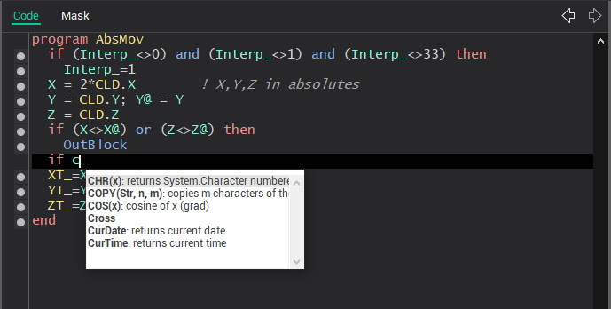

# Programs debugging

Integrated debugger allows controlling the program execution. The program can be executed step by step with the checking the program code and the execution result. While debugging it is possible to enter into the subprograms or execute the subprogram in one step, to control the variable values and to view the debug messages. The debugger cardinally reduces the postprocessors designing time and lightens the bugs search and elimination.

Debugger functions:

- Program run – [F9];
- Run program to cursor – [F4];
- Step over (execute the current statement without the entering into the subprogram) – [F8];
- Breakpoint setting/resetting – [Ctrl+F8];
- Step into (execute the current statement with the entering into the subprogram) – [F7];
- Break the debugging – [Ctrl+F2];
- Add a new variable to the watch list – [Ctrl+F7];
- Evaluate expression – [Ctrl+F4].

Before the program is started the all modified subprograms are compiled. If there are no errors found while compilation then the program is started.

To start the program execution it is possible by any of commands: [F4], [F7], [F8] or [F9].

[F4] runs the program to the statement on the cursor position. If current string has not the statement then the program is executed to the end. The string where the execution was break is the debugger cursor that is selected by color.

If debugging is started then [F7] and [F8] executes the statement of a program where the debugger cursor is located else the debugger cursor is set on the first statement of the first program. Command [F7] as distinct from [F8] allows entering into the subprogram if the current statement is a **CALL**.

[Ctrl+F8] allows to set/reset a breakpoint. When the program execution arrives at the breakpoint then the execution will be paused with the debugger environment activation.

In any point of debugging process, it is possible to break the execution by [Ctrl+F2] or to continue the execution without debugging by [F9].

The changing of the lines number in the debugged program brings the incorrect indication of the current debugger cursor.

[Ctrl+F7] allows adding the variable or the expression to the watches list. If [Ctrl+F7] is pressed in the editing mode then variable name is taken from the current position of cursor. In the debugging mode then the mouse pointer is located under the variable then the variable value is highlighted in the hint.

To search for a word, double-click on this word and a new tab will appear with a list of all mentions of this word in all commands.

When editing code of programs to enter the names of predefined functions and variables is convenient to use a popup-hint. You can call it at any time while editing by pressing the key combination [Ctrl+space]. The window that appears contains a list of standard features, matching the already entered in the editor part of the word, and also shows a short description of these functions. After double-clicking on one of the rows in the list the function selected in it will be added to the current position of editor.

**See also**

[The main window](readme-main-window.md)
