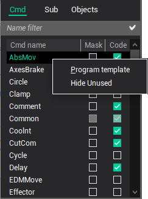

# The programs for the CLData commands processing

Like the masks, the programs serve to define the transformation process from the CLData command to the NC code line. The programs can expand the mask or can be used instead the masks. Both the mask and the programs have merits and demerits. The programs is the flexible and powerful tool for the realization of the very complicated transformation. However, the learning of this tool requires the programming experience.

Any CLData command has the corresponding processing program.

These programs are designed using the special problem-oriented language and can contain the mathematical expressions and the functions, statements for input/output, conditional statements, cycles, jump statement, subroutines calls, the statements to form the NC-program blocks and the statements to work with the technological commands file. This language is described in detail in the [Language description](../../language-description/readme-language-description.md) chapter.

Each program begins from the header, which consists of the [PROGRAM](../../language-description/operators/processing-program-start-operator-program.md) keyword and the program name, and terminates by the **END** keyword. The program name is coincident with the command name, processed by it. When the program is called, the parameters are passed to it via the predefined [CLD](../../language-description/basic-definitions/predefined-variables-and-functions/miscellaneous-functions-and-variables.md) array and special [Cmd](../../../cldata/functions/current-command.md) operator.

The program activating is performed by the tick setting on the CLData commands list in the code column. If the program is not active then it will not be translated and executed even if the text exists. The program [COMMON](../../language-description/basic-definitions/technology-command-programs-comments.md) is exclusion. It is translated and executed always and at the first. This program is intended to define the global variables i.e. variables that are accessible from any subprogram.

The empty program is generated by double click in the list of technological commands.

When the right mouse button is pressed in the programs list, the context popup window will appear. This popup contains following items:

- **Program template** - the program template is initialized as blank, including a header and an end operator;
- **Hide unused** - unactivated programs will be hidden from view.

Programs have the capability to use subroutines, which are organized in a separate tab section. When the right mouse button is pressed in the subprograms list, the context popup window will appear. This popup contains following items:

- **Insert** – adds a new technological command processing program. The window to input the program name will be opened.
- **Delete** – deletes selected program.
- **Rename** – renames current program. The window to input the program name will be opened.

The editor of the selected program is placed in the center of main window. When other program is selected in the list, its text will be displayed immediately in the edit window.

**See also**

[The main window](readme-main-window.md)
