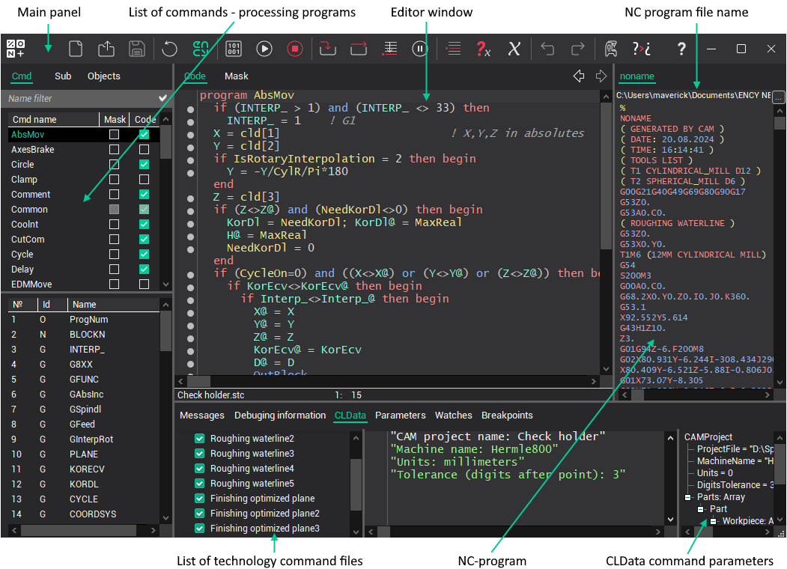
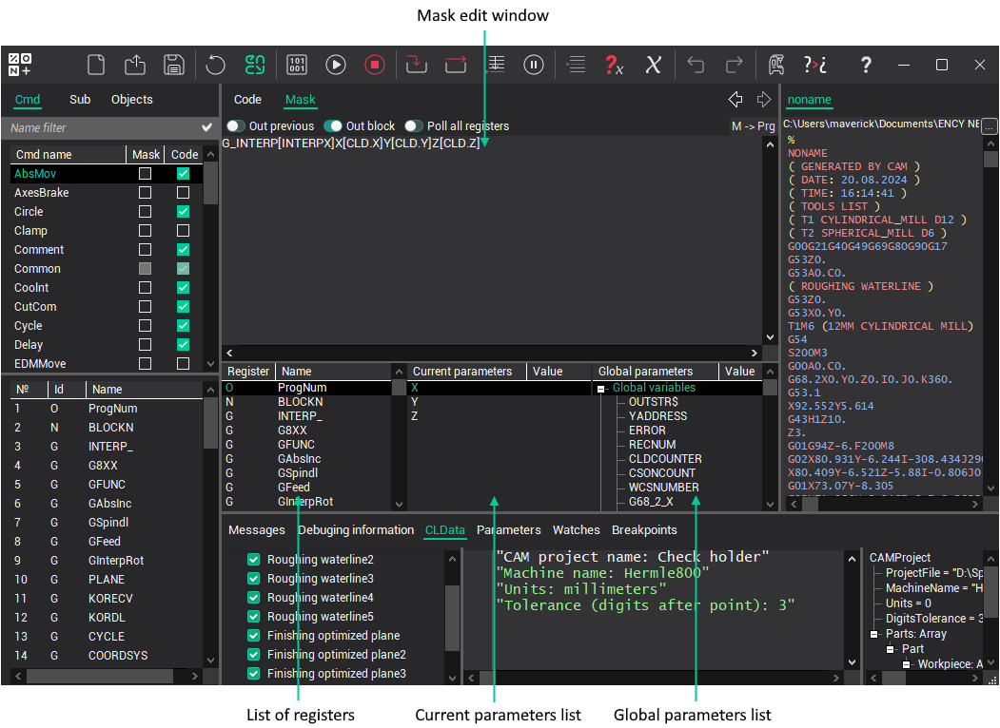

# The main window

The main window:

The [Main toolbar](main-toolbar.md) are placed in the top part of the window. The list of command-processing programs and the list of registers are placed in the left part. There are the switching pages with editor of masks and editor of the command-processing program in the center. Except editor on bookmark, **Mask** is located lists of registers of local and global parameters. In the bottom – there are switching windows of the system messages, debug information, the list of the files, which contain the trajectory of the tool motion and the textual representation window of these files, the list of controllable variables and the list of break points.

**See also**

[The main toolbar](main-toolbar.md)

[System settings](system-settings.md)

[Editor settings](editor-settings.md)

[Defining the data about the NC-machine and CNC-system](machine-parameters/defining-the-data-about-the-nc-machine-and-cnc-system.md)

[Comments transliteration](machine-parameters/comments-transliteration.md)

[The block structure and format definition](block-structure-and-format-definition-register-list-forming.md)

[The masks for the machining commands translation](masks-for-the-machining-commands-translation.md)

[The programs for the CLData commands processing](programs-for-the-cldata-commands-processing.md)

[Subprograms](subprograms.md)

[The command processing programs compilation](command-processing-programs-compilation.md)

[The work with the files of technological commands](work-with-the-files-of-technological-commands.md)

[The trial NC-programs generation](test-nc-code-generation.md)

[Programs debugging](programs-debugging.md)
