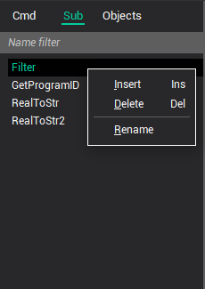

# Subprograms

**Subprograms** tab holds the list of user defined subprograms and the [Filter](../../../cldata/commands/filter.md) subprogram. Use the context menu to add, remove or rename subprograms. The code of the subprogram can be viewed or edited in the code editor. The code editor displays the code of the selected subprogram.

The name of the subprogram can be any legal string identifier, provided it is not the name of a technology program or already used by other subprogram.

The principles of definition and syntax of subprograms are described in the Language description, Subprograms topic.

**See also**

[The main window](readme-main-window.md)
