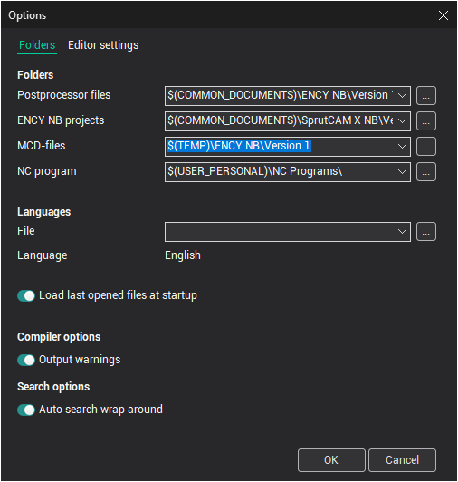

# System settings

The window of system settings can be activated from main menu. The default paths for the system files and languages are defined here.

The postprocessor adjustment files for various NC-system (*.sppx files) are loaded from the **Postprocessor files** directory. New postprocessor tuning files will be saved in this directory.

The CAM system projects are loaded as default from the **CAM system project** directory. The technological commands files (*.mcd), which are linked with opened project will be loaded from the corresponding paths, described in the project file.

The separate technological commands files (*.mcd) are loaded, as default, from the `MCD-files` directory.

Generated NC-programs are saved, as default, in the `NC-programs` directory.

To change program language it is necessary use **Languages** panel.

These paths may be edited manually or using dialogs, which can be activated by pressing  button.

In a system, there is a preconceived variable, which one may be used for definition of the conforming folders:

At determining actual names of folders during operation the indicated variable will be substituted by the conforming full path at the moment of activation of a system or at the moment of the last editing the system settings.

For load last opened *.SPPX file at activation of the generator of postprocessors there is a check box **Load last opened file at startup**.

**See also**

[The main window](readme-main-window.md)
