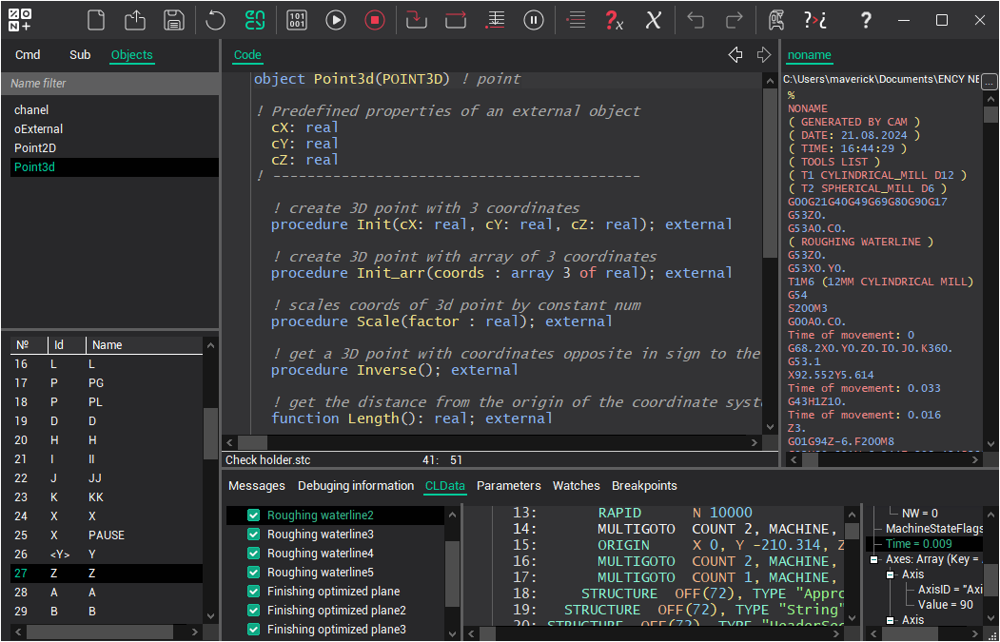
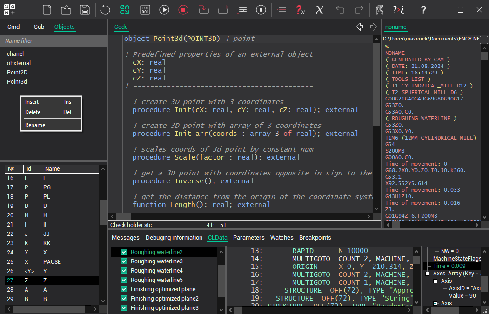
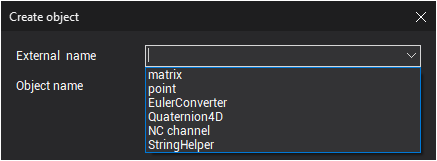

# Objects

Variables of this type represent a complex structure consisting of fields and methods. Objects describe the structure of a dynamic variable that appears only during program execution. Such a variable is an instance of an object.

Properties are variables of type REAL, INTEGER, STRING, RECORD, or array. Object properties are data elements that are copied into each instance of the object.

Method is a procedure or function associated with an object. Inside methods, only the properties of the object instance for which the method was called are accessible. A function differs from a procedure in that it returns a result. It can be used in assignment statements, mathematical and string expressions, in the print statement, in logical expressions. The result of the function's action in its description is located in the predefined variable `result`.

Field declarations are made after the object declaration, method descriptions are made after the field declarations.

The predefined variable `self` is a hidden parameter for each method in the object. It allows the method to access the object. This is especially important when the method parameters are the same as the object variables intended to hold these passed values. Example:

```
 object sample
   xx1, yy1, zz1: real;
 procedure init(xx1, yy1, zz1: real)
 begin
   self.xx1=xx1; self.yy1=yy1; self.zz1=zz1
 end
```

An example of sending of the object to subprogram:

```
 object sample2
 procedure proc
 begin
   call subproc(self)
 end
```

The object description ends with the command `end.`.



Creating a new object, deleting or renaming an existing object is done through the context menu in the object list.



When creating a new object, a window will appear:



Here **External name** is the name of the external library, the entire implementation of which is done in Delphi. **Object name** is the name under which the object will be accessible in the system.

Currently available:

- **[EulerConverter](eulerconverter.md)** – spatial rotations using Euler angles.
- **[Matrix](matrix.md)** – three-dimensional matrix.
- **[Point3D](point3d.md)** – three-dimensional point.
- **[Quaternion4d](quaternion4d.md)** – quaternion (4D vector).
- **[NCChannel](ncchannel.md)** – solves the problem of managing multiple channels simultaneously.
- **[StringHelper](stringhelper.md)** – basic functions for working with strings, dates and times.

Note: you can create heirs from the presented objects, to which you can add your parameters, but only after the existing parameters!

Declaration of an object instance is done in commands or subprograms similarly to arrays and structures.

Example of declaring and using an object instance:

```
 pp: point2D
 pp.xp=10
 pp.yp=10
 pp.MoveV(45, 10)
 pp.TurnAndMove(45, 15, 25)
 print pp.xp, "; ", pp.yp
```

Objects can be assigned entirely, like ordinary variables. Continuing the previous example:

```
 pp2: point2d
 pp2=pp
```

Also, like ordinary variables, objects can be parameters of procedures, functions, and subprograms:

```
 DrawPoint(pp)
```
