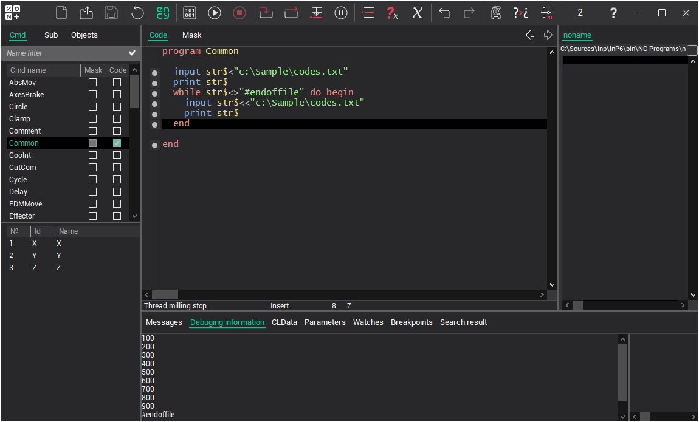

# The input from file

**Syntax**

```
INPUT <variable> | <string variable> < | << "<file name>"
```

**Description**

For file-based disk input, redirect input by adding < or << symbols and the file name after parameters. In this case, when executing the operator, the quoted message (string literal) is displayed on the screen, and data input is performed from the specified file.

- symbol "<" is used to start inputting values into the current input operator's variables from the file's initial line.
- using the "<<" sign continues input operations from the line immediately after the previous input operation's end point in the file.

When the final line is reached, the "#endoffile" value will be obtained.

**Example**


