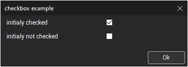

# The input from keyboard

This functionality is intended to input user data from the keyboard during postprocessor program module execution.

**Syntax**

```
INPUT <caption>, <variable> | <string variable>
{, <caption>, <variable> | <string variable> }
{,<caption>, checkbox, <variable>}
{,<caption>,array, <variable>}
caption = "literal string"
```

**Description**

This operator uses the keyword INPUT, followed by a list containing one or more numeric or string variables and string literals. The number of parameters in the list is unlimited; if there is more than one, they are separated by commas.

Executing the operator creates an input window consisting of string literals and input fields. If variables were previously initialized before calling the operator, these values will be entered into the corresponding fields of the window as default values. During input, the system performs type checking for variables. Only numeric values can be entered into a numeric variable, while any characters can be entered into a string variable.

After entering all values, you must close the window by clicking the **OK** button. This assigns the entered values to their respective variables.

To set dialog window title pass "title##caption" as caption. Note that each subsequent "title##caption" parameter will override the dialog title.

To add an image to the input window, use the string "pic=**filename**". The input window will expand to accommodate the image.

The checkbox keyword generates a check box element. Initially, the check box is marked if the variable holds a non-zero value. The returned variable value equals zero for an unchecked state and non-zero for a checked state.

Array data input requires the inclusion of the array keyword. The array type can be string, real, or integer.

This operator functions similarly to an assignment operator, with the key difference that variable values are not assigned from within the program but are requested for input during each execution. Using this operator allows you to write a postprocessor program once and run it multiple times, entering different initial data each time to obtain new results depending on the input values.

Each edit field has two buttons to work with the Windows clipboard:

-  – Copies the edit field text into clipboard (shortcut: [Ctrl+C]);
-  – pastes the text from clipboard into the edit field (shortcut: [Ctrl+V]).

**Examples**

```
INPUT "Sample data input: ", Zt
MachineName$ = "Leader"
INPUT "Input the NC-machine name: ", MachineName$
wx = 10; wy = 10; wz = 5
INPUT "Workpiece dimensions",
"Along X axis", wx,
"Along Y axis", wy,
"Height by Z", wz
! Window title and name configuration via variables. notice the '""+' trick to make PP use the variable caption and title:
rr = 2
title$ = "title"
caption$ = "caption"
input "" + title$ + "##" + caption$, rr
! Select variables from the list:
arr: array of real
arr[1] = 1.1
arr[2] = 2.2
input "caption", arr, rr
! Checkbox input example. notice the '""+' trick to make PP use the variable caption
title$ = "checkbox example"
caption1$ = "initialy checked"
caption2$ = "initialy not checked"
init_checked = 1
init_unchecked = 0
input "" + title$ + "##" + caption1$, checkbox, init_checked, "" + caption2$, checkbox, init_unchecked
```



**See also**

[The output statement **PRINT**](../output-statement-print.md)
