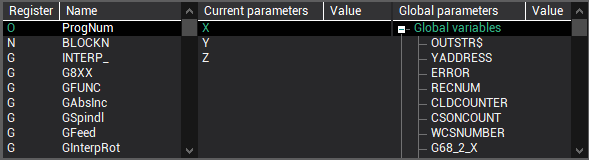
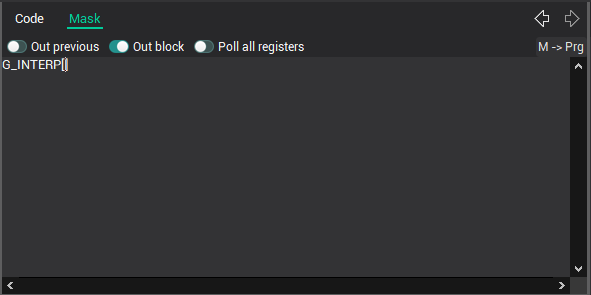
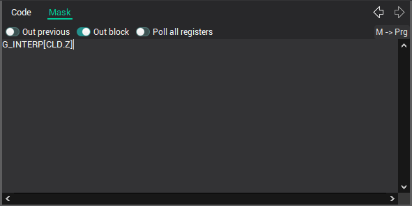

# The interactive to create the masks

There are the three lists for the comfortable masks editing. These lists are placed under the mask editor. The left list is the list of the registers. The second list is the list of the current CLData command parameters. The right list is the list of the global variables and predefined functions.

The double click on the registers list inserts the selected register name to the cursor position. The chars `[]` added after the register name and the cursor moves to the position between.

The double click on the current parameters list inserts the CLData parameter name to the cursor position. Prefix [CLD](../../language-description/basic-definitions/predefined-variables-and-functions/miscellaneous-functions-and-variables.md) is added to the parameter.

**See also**

[Postprocessor masks](../readme-postprocessor-masks.md)
