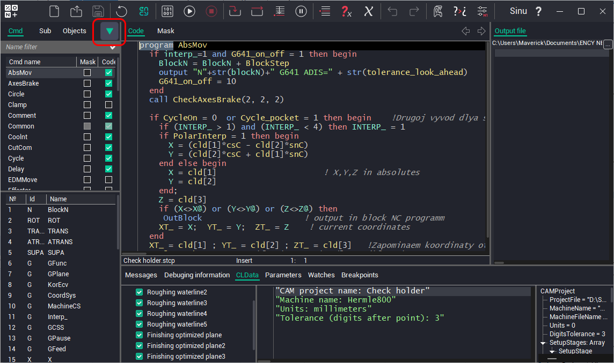
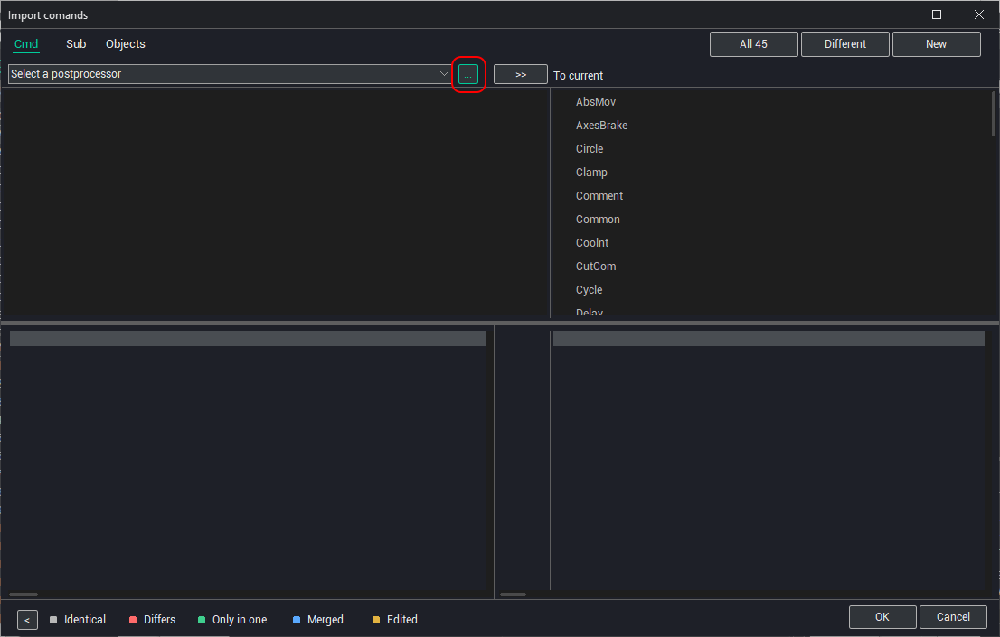
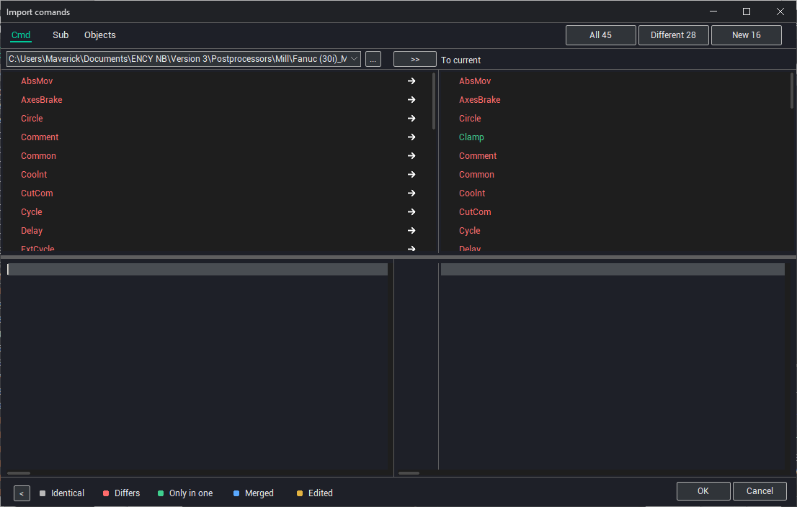
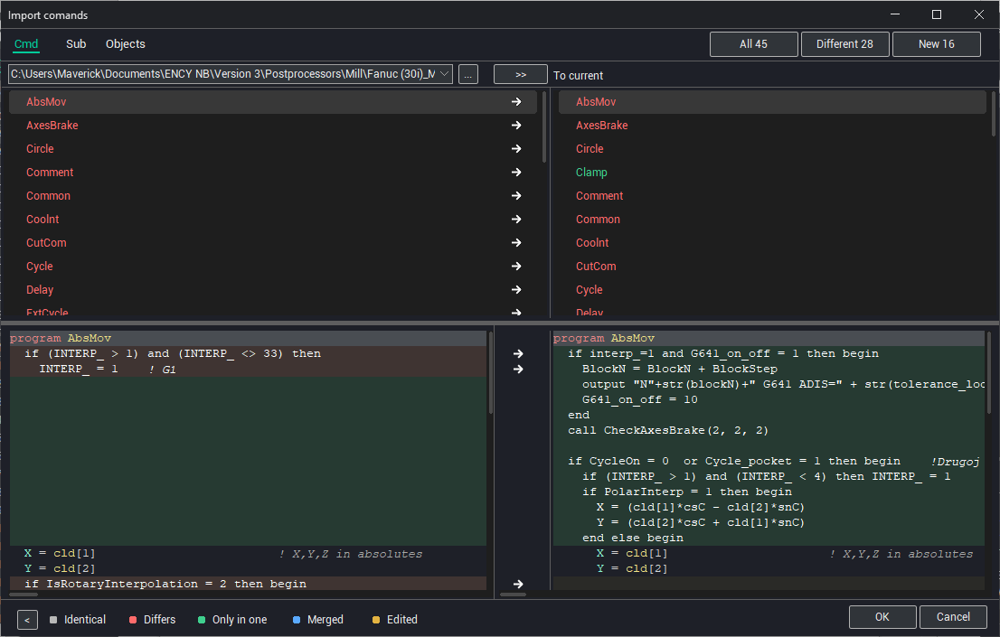
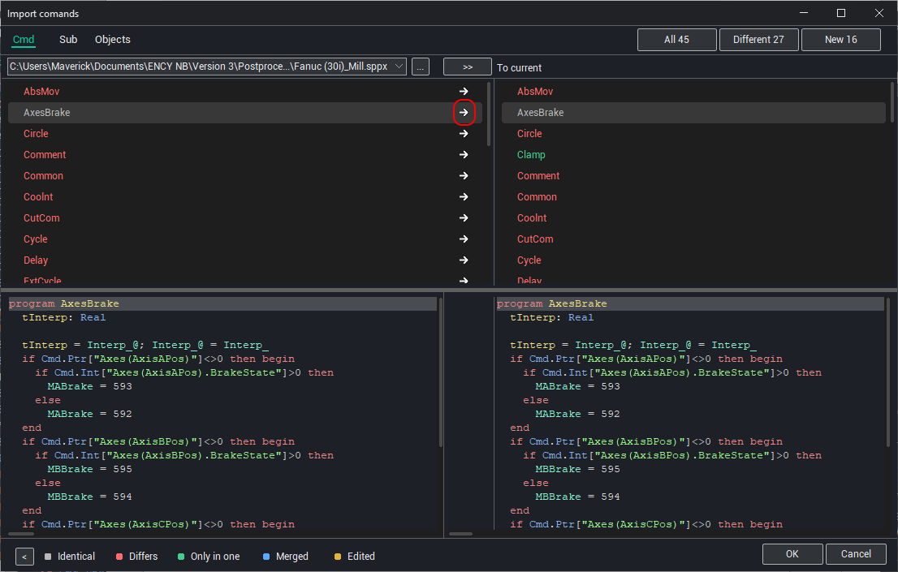
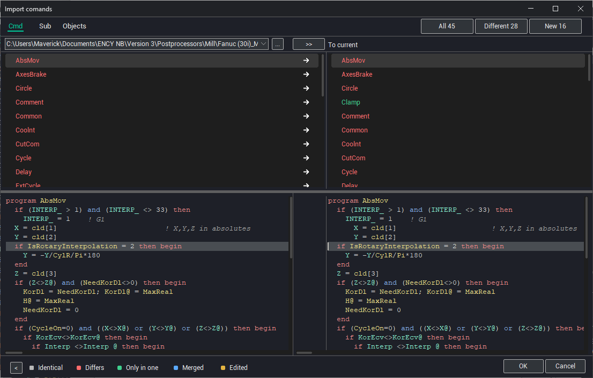
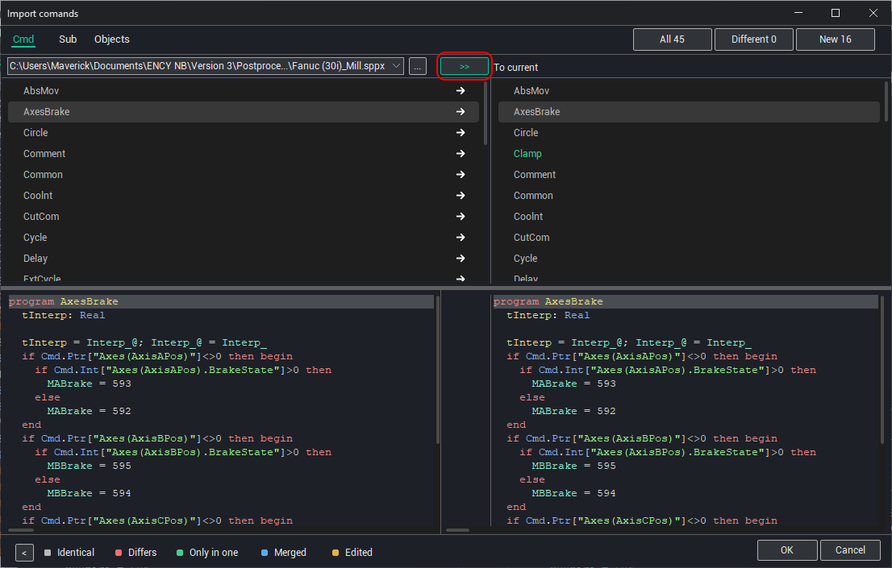

# Importing commands, subprograms, and objects

The Import window lets you compare the current postprocessor with another postprocessor and import commands, subprograms, and objects from it. You can import a complete item or only selected differing code fragments.

Open the Import window by clicking the arrow button in the **Cmd**, **Sub**, or **Objects** selector.

Click the postprocessor selection button and select the postprocessor from which you want to import items.

After the postprocessor is loaded, the left side of the window displays its items, and the right side displays the items of the current postprocessor.

The item color shows the comparison result:

- red -- the item exists in both postprocessors, but its contents differ;
- green -- the items are identical;
- black -- the item is missing from the other postprocessor.

Select an item highlighted in red to view its code in both postprocessors.

To replace an item in the current postprocessor completely with the version from the imported postprocessor, click the arrow next to the item name.

To import only one differing fragment, click the arrow next to that fragment in the code pane of the current postprocessor.

To replace all items in the current postprocessor with the versions from the imported postprocessor, click **Merge all to current**.

You can load another postprocessor for comparison and then return to a previously loaded postprocessor. Select the required postprocessor in the drop-down list next to the load button.

**See also**

[The main window](readme-main-window.md)
