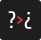
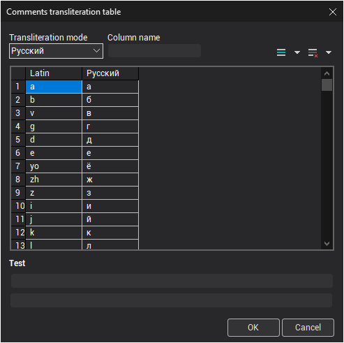
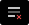

# Comments transliteration

Comments transliteration operation is used by postprocessor to transliterate comments in NC-program (passed through [COMMENT](../../../../../cldata/commands/comment.md) technology command) that contain symbols not supported by the CNC system (for example non ASCII symbols) into literals that contain only the symbols that are acceptable for the CNC system.

Transliteration parameters are set by pressing the  button on the [main toolbar](../main-toolbar.md).

**Transliteration mode** set the original language of the comments (the active column in the transliteration table). Set to **Off** by default.

Each language that can be transliterated is represented by a column in the transliteration table. The first column **Latin** is the main column which symbols will be used to transliterate symbols from other languages. The rows of the table define which symbols in the active language will be transliterated (rows of the active column) and specify the transliterated symbols or symbol combinations (the **Latin** column).

The transliteration table can be modified at any time, you can add, remove or rename columns, and can add, remove or modify the rows and cells of any column. Use the **Column name** edit field to change the name of the column. Use the following buttons to add and remove rows and column of the table:

-  **New row** – adds new row after selected;
-  **New column** – adds new column after selected;
-  **Delete row** – deletes selected row;
-  **Delete column** – deletes selected column.

The **Test** panel is used to test the transliteration settings live. When you type some text into the upper edit field, the system writes the transliterated text into the lower field.

**See also**

[The main window](../readme-main-window.md)
