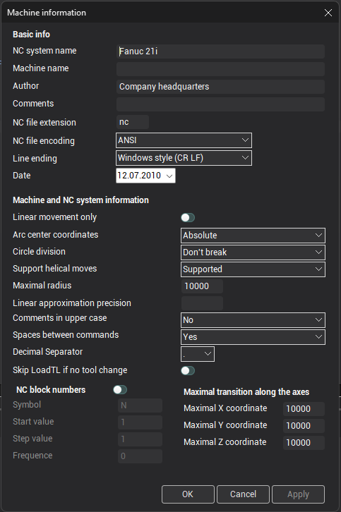

# Defining the data about the NC-machine and CNC-system

The editing window of the data about the NC-machine and the CNC-system can be opened by pressing the  button on the [main toolbar](../main-toolbar.md).

The name of NC-machine, the name of CNC-system and the extension of NC-program files are displayed in the **Basic info** panel. The name of NC-machine and the name of CNC-system are informative parameters only. All NC-programs, which will be generated using edited tuning-file, will be saved with the specified extension.

On the **Machine and NC system information** panel defined corresponding parameters:

In a field **Arc center coordinates**, the mode of the definition of circle center is determined. If the relative mode of the definition of center of a circle in the variables [XC](../../../language-description/basic-definitions/predefined-variables-and-functions/miscellaneous-functions-and-variables.md), [YC](../../../language-description/basic-definitions/predefined-variables-and-functions/miscellaneous-functions-and-variables.md), [ZC](../../../language-description/basic-definitions/predefined-variables-and-functions/miscellaneous-functions-and-variables.md) are set concerning for current selected point. If the absolute mode of the definition of center are set in absolute values is selected.

In a field **Circle division** is offered to select a mode of introducing of arcs in a NC program (a quarter, half or a full circle). The postprocessor during operation arrests intersection arcs of quadrants and, if necessary, dissects arcs into halves or quarters.

In a field **Support helical moves** are set with the information on support by a CNC system of helical moves. If helical moves are not supported, the postprocessor automatically approximates helical arcs on lines and shapes commands of linear movements.

In a field **Maximal radius** is entered a value of maximum radius of the arc bolstered by a CNC system, at overflow which one the postprocessor substitutes arcs linear movements. The value 0 in it a field disconnects monitoring, and the system will not approximate an arc at any value of radius.

For an event when the CNC system at all does not support arc interpolation and helical moves, check box **Linear movements only** is stipulated. In this case, all arcs without dependence from fields **Support helical moves** and **Maximal radius** are dissected into linear movements.

The capability stipulated to shape **Comments in upper case** and to place **Spaces between commands** of NC program.

For forming a block number there is a group of fields **NC block numbers**. If the corresponding checkbox on the panel is not set, then auto-numbering frames feature is disabled. If this checkbox to include, it will become available a number of fields to set up automatic numbering. The group consists of fields **Symbol**, **Start value**, **Step value**, **Frequency**. In a field **Symbol** is entered the identifier of the register or a symbol injected in block before a value of a block number. If this field is specified identifier register, then there is the possibility of additional control over the frame number by setting the format of the register (for example, if the frame number will go beyond the range of possible values of the register, then the numbering starts again). In the case of automatic numbering blocks are numbered since **Start value**. After each output of block to a block number **Step value** is added. The step value is available not only from the window **Basic parameters**, but also in the program through the predefined variable [BlockStep](../../../language-description/basic-definitions/predefined-variables-and-functions/miscellaneous-functions-and-variables.md).

Block number outputs with the given frequency. If frequency is equal to 1 the block number outputs in each command of forming of block if 2 – through one command, 3 – through two commands etc. If frequency is equal to zero the block number is not output.

**Maximal transitions along the axes** allow inspecting a correctness of a NC program. At overflow of as much as possible admissible transition on one of coordinates, the conforming warning will be show.

**Decimal separator** symbol which will be output into NC-block in place of decimal separator in numbers.

**Skip LoadTL if no tool change** - skips calling the LoadTL command handler if it does not actually change the tool relative to the previous operation. When option is enabled and if the "ToolChanged" property of the [LOADTL](../../../../../cldata/commands/loadtl.md) command has value 0 (false), the LoadTL procedure for this command will not be called.

The **OK** button closes the window and saves all modifications. The **Cancel** button closes the window and discards all modifications.

**See also**

[The main window](../readme-main-window.md)
