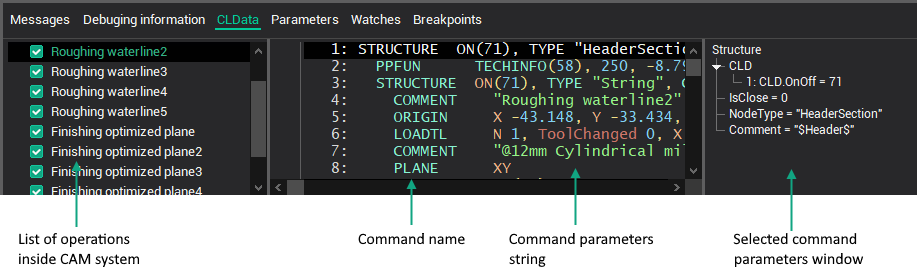

# The work with the files of technological commands

The files of technological commands can be loaded from the CAM system project (*.stc, *.stcx). The pressing the button or the choosing the corresponding item in the main or context menu loads the file.

When the files of the technological commands are loaded from the CAM system project, the project name, which contains these files, will be displayed on the [main panel](main-toolbar.md).

In the bottom part of main window on the **CLData** page the list of machining commands files is located. Any line of the list corresponds to a CAM system operation. Only ticked operations will form the NC code.

The operations list can be edited by popup menu. Click right mouse button in the list field to open popup menu. Menu contains the next items:

- **Insert** – adds the file of the technological commands;
- **Delete** – deletes selected file;
- **Delete all** – deletes all files.
- **Update CLData** – requests new CLData files from project opened in CAM system.

In the center of the **CLData** tab is located a text representation of technological commands (CLData commands). It displays a list of commands for a file that is highlighted in the list on the left. Each technological command in the CLDATA text is a separate line, consisting of the command name and its parameters. When the left mouse button is double-clicked on the command name, the mask corresponding to the command will be loaded to the masks editor and the program corresponding to the command will be loaded to the programs editor.

To the right of the list of commands technological command parameters window located. It contains a list of parameter names and their values for the selected command. To quickly obtain the value of a parameter in the program code, you must activate the appropriate parameter and select the **Add parameter to code** item in the popup menu (opens right mouse button click) or to double-click the left mouse button. The parameters are accessible via the [CLD](../../language-description/basic-definitions/predefined-variables-and-functions/miscellaneous-functions-and-variables.md) array or [Cmd](../../../../cldata/functions/current-command.md) operator in the programs and via the current command parameters list in the masks.

**See also**

[The main window](readme-main-window.md)
