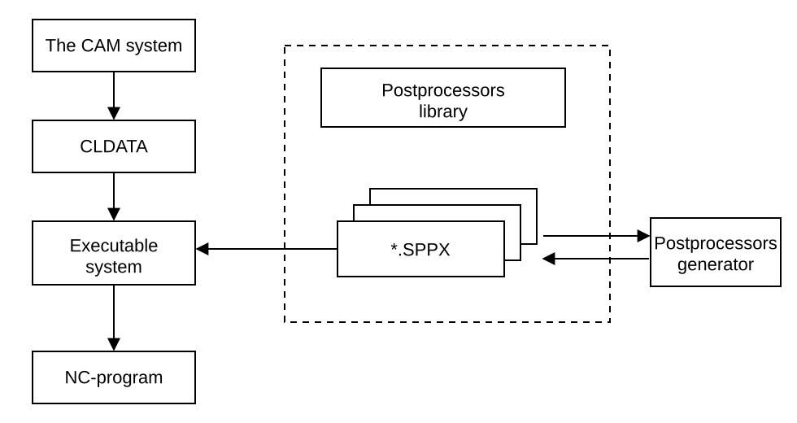

# The principle of postprocessor operation

Postprocessors generator allows to develop the postprocessor adjustment files for the different NC-systems (*.SPPX files). An import of the files from the previous version of postprocessor (*.SPP, *.INP files) is available also. The postprocessor adjustment file contains the descriptions of all features to generate NC-program for the defined NC-system. The executable system of postprocessor uses this description to generate the NC-programs from the files of technological commands (*.MCD, *.STCP, *.STCX files), which can be produced, in turn, by CAM system, for example.

To develop the postprocessor's tuning file, it's necessary to define the data about the NC-machine and NC-system, to describe the structure and the format of the block and to fill the masks or to design the programs to process the technological commands.

The data about the NC-machine and NC-system means the name of the NC-machine and of the NC-system, the limits for displacement along the axes and some additional data.

The structure and the format of the block are defined by the ordered sequence of the registers and by its parameters. The identifiers and the values of the registers will be output to the NC-block in the same sequence as they are placed in the list.

The mask contains the list of registers in the required order. These registers will be out to the NC-program block for the corresponding technological command.

The special problem-oriented language is used to write the programs to process the technological commands. This language allows the mathematical expressions and functions, the statements for input/output, conditional statements, cycles, jump statement, calls of subroutines, the statements to form the NC-program blocks and the statements to work with the technological commands file.

The data definition about the NC-machine and the CNC-system, the block structure and format description, the programs design to process technological commands are performed in the postprocessors generator environment. The examination of [the technological commands files](main-window/work-with-the-files-of-technological-commands.md) and the [trial generation of the NC-program](main-window/test-nc-code-generation.md) are allowed in this environment too.

The programs sources to process technological commands, the data about the NC-machine and the CNC-system, the masks, the list and the format of registers are saved in the file with the name of concrete postprocessor and the extension *.sppx. The data from this file is used by the executable system of postprocessor to generate the NC-program for the corresponding NC-system.

The run-time postprocessor system reads the data about the machining process from the file of technological commands, analyses the code of the command and activates the program, which processes this command (the name of mask and processing program is coincident with the name of the corresponding command). Then if it was used mask, that forms line of the NC-program for corresponding of mask. The parameters of the technological command are passed via the predefined array [CLD](../language-description/basic-definitions/predefined-variables-and-functions/miscellaneous-functions-and-variables.md) and special operator [CMD](../../../cldata/functions/current-command.md). Called program can change the registers values and internal variables values and it can form the block of the NC-program.

The corresponding statements in the command processing programs generate the block of the NC-program, moreover only the identifiers and values of the registers, which are changed since previous block, will be written in the current block.
