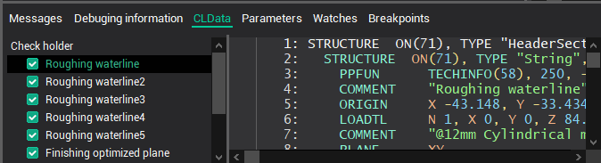

# Operators of work with NC-subroutines

The NC-subroutine represents the sequence of technological commands issued in the form of a separate file of technological commands *.mcd, framed with special technological commands of the beginning of NC-subroutine [PPFUN STARTSUB(50)](../../../../../cldata/commands/ppfun/startsub.md) and the end of NC-subroutine [PPFUN ENDSUB (51)](../../../../../cldata/commands/ppfun/endsub.md).

As is shown in drawing in the list of files of technological commands a files with NC-subroutines are marked with grey color, and change of a condition of a tick near to a file name becomes impossible.

Unlike usual files *.mcd, technological commands in which start to be processed automatically if the corresponding file is marked by a tick near to the name, technological commands in NC-subroutines will be processed only by a call of the special operators beginning with a keyword **NCSUB**, for example, in the course of processing of technological command [PPFUN CALLSUB(52)](../../../../../cldata/commands/ppfun/callsub.md).

Each NC-subroutine is identified by unique number which is defined in parameters of technological commands [PPFUN STARTSUB(50)](../../../../../cldata/commands/ppfun/startsub.md), [PPFUN ENDSUB(51)](../../../../../cldata/commands/ppfun/endsub.md) and [PPFUN CALLSUB(52)](../../../../../cldata/commands/ppfun/callsub.md) the number 2 is accessible in processing procedures through predetermined file [CLD](../../basic-definitions/predefined-variables-and-functions/miscellaneous-functions-and-variables.md). Thus, in procedure of processing expression `CLD[2]` will return number of the corresponding NC-subroutine. Also the NC-subroutine can be characterized by a text name. Initial value of a text name is define in the technological command a [COMMENT](../../../../../cldata/commands/comment.md) which place before technological command [PPFUN STARTSUB(50)](../../../../../cldata/commands/ppfun/startsub.md). In procedures of processing of technological commands the text name of the NC-subroutine can be read, and also is modified by the operator [NCSUB.NAME(n)](operator-of-definition-of-a-name-of-nc-subroutine.md), where **n** – unique number of the NC-subroutine.

In the course of translation of technological commands in the operating program it can be demanded to identify text of the beginning and the end of the concrete NC-subroutine (to define markers or numbers of frame). For these purposes, are intended a operators of definition of initial and final markers of the subroutine [NCSUB.STARTLABEL(n)](operator-of-definition-of-an-initial-marker-of-nc-subroutine.md) and [NCSUB.ENDLABEL(n)](operator-of-definition-of-a-final-marker-of-nc-subroutine.md), where **n** – unique number of the NC-subroutine.

**See also**

[The operator of a output of NC-subroutine `NCSUB.OUTPUT`](operator-of-a-output-of-nc-subroutine.md)

[`NCSUB.OUTPUTALL` operator](operator.md)

[The operator of definition of a name of NC-subroutine `NCSUB.NAME`](operator-of-definition-of-a-name-of-nc-subroutine.md)

[The operator of definition of an initial marker of NC-subroutine `NCSUB.STARTLABEL`](operator-of-definition-of-an-initial-marker-of-nc-subroutine.md)

[The operator of definition of a final marker of NC-subroutine `NCSUB.ENDLABEL`](operator-of-definition-of-a-final-marker-of-nc-subroutine.md)

[Technique of work with NC-subroutines](technique-of-work-with-nc-subroutines.md)
